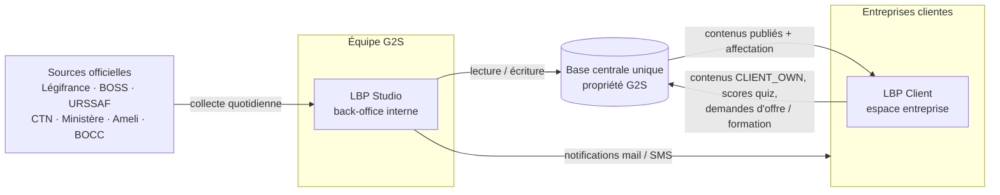
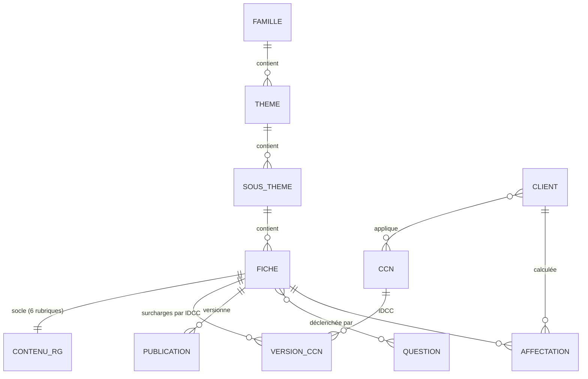
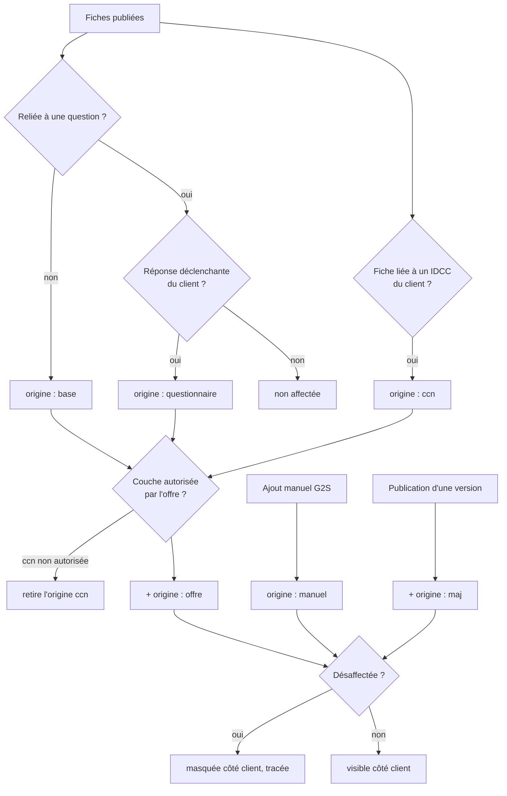

# ARCHITECTURE.md — LBP Client & LBP Studio

> Ce document décrit l'architecture **telle qu'elle existe dans la maquette V9.9** (`LBP_V9_9_Studio.html`)
> et l'architecture **cible** vers laquelle elle doit migrer. Les sections marquées
> **[CIBLE · PROPOSITION]** ne sont pas validées par l'équipe technique.

---

## 1. Vue d'ensemble



Il y a **deux applications et une seule base**. Le Studio écrit tout, et le Client ne lit que ce qui a été **publié** et **affecté** au client concerné.

---

## 2. Architecture actuelle (maquette V9.9)

| Aspect      | Réalité de la maquette                                                                                                  |
| ----------- | ----------------------------------------------------------------------------------------------------------------------- |
| Livrable    | Un seul fichier HTML d'environ 2,5 Mo                                                                                   |
| CSS         | Environ 2 500 lignes en un seul `<style>`, organisées en couches successives (la dernière fait foi, voir `design.md`)   |
| JS          | Environ 9 400 lignes de JavaScript vanilla, environ 800 fonctions, dans un seul `<script>`, avec des variables globales |
| Rendu       | Chaînes HTML injectées par `innerHTML` et handlers `onclick` inline (environ 470)                                       |
| Médias      | Plus de 130 JPEG et 1 PNG (logo) intégrés en base64                                                                     |
| Dépendances | Aucune, hormis Google Fonts (Archivo, IBM Plex Mono)                                                                    |
| Persistance | `localStorage`, en simulation uniquement                                                                                |
| Routage     | Affichage et masquage de `.view` via `goView(id)` côté Client ; `stGo()` et `stPaint()` côté Studio                     |
| Auth        | Simulée : liste `ST_USERS` et mots de passe en clair                                                                    |

### 2.1 Découpage logique du script (blocs d'en-tête)

| Domaine     | Blocs principaux de la maquette                                                                                                                                          |
| ----------- | ------------------------------------------------------------------------------------------------------------------------------------------------------------------------ |
| Socle       | Icônes (`ICONS`, `ico`, `hydrateIcons`) · Persistance (`lbpSave/Load`, `stSave/Load`) · Recherche (`norm`)                                                               |
| Référentiel | Référentiel maître (4 niveaux) · Blocs conventionnels · Versions conventionnelles · Fiches étalon (01.01, 02.03) · Atelier de construction · Publication de la structure |
| CCN         | Référentiel dynamique des CCN · Rapprochement par IDCC · Administration du référentiel CCN                                                                               |
| Import      | Lecture native `.docx` · Lecture des styles Titre 1/2/3 · Reconnaissance des sous-rubriques · Écran de contrôle du mapping · Moteur unique d'import Word                 |
| Affectation | Moteur d'affectation (`computeAffectation`) · Questionnaires                                                                                                             |
| Contenus    | Contenus maîtres (`DATA_ORIGIN`, `SLOTS`) · Chiffres Paie · Dictionnaire · Actu-Veille · Calendrier RH · Offres                                                          |
| Workflow    | Composant commun de publication et de notification · Veille réglementaire (§ 53) · Tâches et journal                                                                     |
| Studio      | Navigation · Étiquettes · Assistant de création client (9 étapes) · Visualisation du LBP Client · Éditorial Actu                                                         |
| Client      | Pages de vue · Page article · Éditeur enrichi · Lecteur de quiz · Demande de formation · Badges « Nouveau » · Liens directs vers une fiche                               |

---

## 3. LBP Client — vues

| Vue (`#v-…`) | Libellé                       | Contenu                                                                |
| ------------ | ----------------------------- | ---------------------------------------------------------------------- |
| `overview`   | Accueil                       | Message d'accueil, KPI, calendrier, dernières mises à jour, offre      |
| `documents`  | Mon entreprise                | Fiche entreprise, équipe, documents (CCN, accords, charte)             |
| `docdetail`  | Détail d'un document          |                                                                        |
| `calendrier` | Calendrier RH                 | Échéances paie et déclaratives, temps forts, événements personnels     |
| `biblio`     | La bibliothèque               | Familles → thèmes → sous-thèmes (accordéon)                            |
| `fiche`      | Fiche                         | 6 rubriques, choix RG ou CCN                                           |
| `majfiche`   | Mise à jour de fiche          | « Ce qui a changé »                                                    |
| `decrypt`    | Actu-Veille · Décrypt RH&Paie | Articles, à la une, « Ne rien manquer », « En bref »                   |
| `article`    | Article                       | Page pleine, jamais une modale                                         |
| `chiffres`   | Chiffres Paie                 | Tableaux de valeurs sourcées                                           |
| `dico`       | Dictionnaire                  | Termes de paie                                                         |
| `quiz`       | Quizz                         | Une question à la fois, chronomètre de 25 s (`QUIZ_TIME_PER_QUESTION`) |
| `offres`     | Offres                        | Consultation et demande d'évolution                                    |
| `help`       | Prise en main                 |                                                                        |
| `search`     | Recherche globale             |                                                                        |
| `account`    | Mon compte                    |                                                                        |

**Profils côté client** : DRH / gestionnaire et salarié (choisis dans la modale de connexion).

---

## 4. LBP Studio — navigation

`ST_TABS` (le commentaire du code annonce 8 onglets, mais la liste en contient 9) :

| Onglet               | Rôle                                                                                  |
| -------------------- | ------------------------------------------------------------------------------------- |
| Tableau de bord      | KPI, tâches « À traiter », dernières publications, alertes d'entretien                |
| Clients              | Liste, fiche client, assistant de création, visualisation du LBP du client            |
| Référentiel          | Atelier : familles, thèmes, sous-thèmes, fiches, versions CCN, import Word            |
| Questionnaires       | Questions déclenchant l'affectation de fiches                                         |
| Contenus LBP         | Sous-onglets : Chiffres Paie · Dictionnaire · Actu RH & Paie · Calendrier RH · Offres |
| Publications         | File de publication, programmation, historique                                        |
| Veille réglementaire | Veille du jour, analyse, propositions, circuit complet                                |
| Entretiens clients   | Suivi annuel, seuils rouge / jaune                                                    |
| Administration       | Utilisateurs, rôles, paramètres (`ST_CFG`), référentiel CCN                           |

### 4.1 Rôles G2S (`ROLES`)

| Rôle                           | Droits                           |
| ------------------------------ | -------------------------------- |
| `super` — Super administrateur | tout et gestion des utilisateurs |
| `admin` — Administrateur       | tout                             |
| `redac` — Rédacteur            | fiches, veille                   |
| `valid` — Validateur           | valider, publier                 |
| `lecture` — Lecture seule      | aucun                            |

### 4.2 Paramètres administrables (`ST_CFG`)

`entretienSeuilRouge: 15` · `entretienSeuilJaune: 60` · `entretienPeriodeMois: 12` · `veilleHeureNotif: '11:00'` · `veilleNotifMail: true` · `veilleNotifSms: true`.

---

## 5. Modèle de données

### 5.1 Référentiel (hiérarchie)



Chaque niveau porte un **identifiant stable**, un titre, un numéro, un ordre, une couleur, un statut, des dates, un auteur et un historique.
Familles de démonstration : `FAM-VIE` (Vie du salarié), plus Rémunération et Cotisations.

**Fiche** :

```text
FICHE
 ├─ contenu (régime général) : 6 rubriques
 │    essentiel · comprendre · maitriser · application · vigilance · quiz
 ├─ ccnVersions{ IDCC → seulement les parties modifiées }
 ├─ ccnBlocks[] { cid, textes, etat, blocks[], maj, auteur }
 │    types de bloc : h (sous-titre) · p · table · ex (exemple chiffré) · vig · note
 ├─ accords d'entreprise   (propres au client, jamais partagés)
 └─ spécificités client
```

Deux CCN peuvent avoir des sous-rubriques totalement différentes. Le modèle reproduit le Word, il n'impose pas de structure.

### 5.2 Collections persistées

| Clé `localStorage`       | Collections                                                                                                                                                                                                                                                                                               |
| ------------------------ | --------------------------------------------------------------------------------------------------------------------------------------------------------------------------------------------------------------------------------------------------------------------------------------------------------- |
| `lbp_demo_v3` (Client)   | `VEILLE`, `PROPOSALS`, `VHISTORY`, `SUBTHEMES`, `FICHES`, `FICHE_META`, `NOTIFS`, `QUIZZES`, `QZSCORES`, `ARTICLES`, `TASKS`, `CAL_EVENTS`, `DICO`, `NEWMARKS`, `OFFERS`, `DOCS`, `IDENT`, `TEAM`, `PAIE`, `OUTILS`                                                                                       |
| `lbp_studio_v7` (Studio) | `CLIENTS`, `MASTER_FAMILIES`, `MASTER_THEMES`, `MASTER_SUBS`, `MASTER_FICHES`, `QUESTIONS`, `VERSIONS`, `PUBLICATIONS`, `VEILLE_DAYS`, `ST_LOG`, `ST_TASKS`, `ST_USERS`, `ST_CFG`, `ENTRETIENS`, `DESAFF`, `CCN_REF`, `CHIFFRES_MASTER`, `CAL_G2S`, `CAL_CLIENT`, `ARTICLES`, `REDACTEURS`, `ACTU_THEMES` |

⚠️ `ARTICLES` est persisté dans **les deux** magasins. En cible, il n'existe qu'une seule source.

### 5.3 Origine des données

| Origine            | Code          | Exemples                                                      | Règle                                        |
| ------------------ | ------------- | ------------------------------------------------------------- | -------------------------------------------- |
| Contenu commun G2S | `MASTER`      | chiffres, dictionnaire, actu, calendrier, offres, référentiel | Une source, plusieurs emplacements (`SLOTS`) |
| Spécifique client  | `CLIENT_SPEC` | identité, CCN, établissements, affectations manuelles         | Administré par G2S                           |
| Propre au client   | `CLIENT_OWN`  | événements perso, documents internes                          | Jamais écrasé, jamais propagé                |

### 5.4 Statuts

- **Contenus** : `draft` → `review` → `valid` → `scheduled` → `published` → `archived` (et `hist` pour l'historique).
- **Propositions de veille** : `a_traiter` → `en_cours` → `traitee` | `sans_suite`.
- **Clients / utilisateurs** : `actif` / `active`. Les deux orthographes coexistent dans la maquette et doivent être unifiées.

### 5.5 Offres

| t   | Nom            | Prix     | Utilisateurs | Couches (`OFFRE_LAYERS`)   |
| --- | -------------- | -------- | ------------ | -------------------------- |
| 1   | LBP Essentiel  | 199 €/an | 3            | `rg`                       |
| 2   | LBP Métier     | 349 €/an | 5            | `rg`, `ccn`                |
| 3   | LBP Entreprise | 600 €/an | 10           | `rg`, `ccn`, `ent`         |
| 4   | LBP Signature  | 990 €/an | 20           | `rg`, `ccn`, `ent`, `proc` |

Libellés des couches (`LVLABEL`) : Réglementation · Convention collective · Accords & usages · Process internes.

---

## 6. Flux principaux

### 6.1 Affectation des fiches à un client (`computeAffectation`)



Une fiche qui n'a pas d'autre origine que `offre` ou `maj` est retirée.

### 6.2 Veille réglementaire (§ 53)

```text
Sources → collecte quotidienne → filtrage → veille du jour → notification (heure ST_CFG)
→ analyse → décision G2S → questionnaire → modification (surlignée en jaune) → comparaison
→ prévisualisation → clients impactés → checklist → « ce qui a changé »
→ validation → publication → notification client → historique
```

Sources : Légifrance JORF, BOSS, URSSAF, Code du travail numérique, Ministère du travail, Ameli, BOCC.
**Aucune suggestion n'atteint un client sans publication explicite G2S.**

### 6.3 Publication et notification (composant commun)

Le même écran de prépublication sert pour tous les contenus. Il présente :

- les changements (ancienne valeur → nouvelle valeur) ;
- les emplacements d'affichage (`SLOTS`) ;
- les clients impactés ;
- les canaux de notification (mail, SMS, in-app) et un aperçu de la notification ;
- la programmation de la date de publication.

### 6.4 Import Word des fiches

```text
.docx → docxParse (lecture native, sans dépendance) → lecture des styles Titre 1/2/3
→ wordAnalyseDocx (reconnaissance des 6 rubriques + sous-rubriques)
→ écran de contrôle du mapping → décision G2S → brouillon
```

### 6.5 Création d'un client (assistant en 9 étapes, `WZ`)

Entreprise → Contact référent → Établissements → Offre → Questionnaire & CCN → Calcul (affectation) → Contrôle G2S → Publication → Accès client (invitation par e-mail).

### 6.6 Tâches et journal

- `taskAdd(type, label, cible, ref)` : idempotent, ne recrée jamais une tâche existante, qu'elle soit ouverte ou traitée.
- `taskResolve(type, ref)` : ferme automatiquement une tâche quand l'action est réalisée ailleurs.
- `stLog(action, detail, meta)` : journal partagé, horodaté et attribué à son auteur.

---

## 7. Sécurité — constats sur la maquette

| Constat                                             | Risque                                                         | Traitement attendu en cible                                                                                |
| --------------------------------------------------- | -------------------------------------------------------------- | ---------------------------------------------------------------------------------------------------------- |
| Mots de passe en clair dans `ST_USERS`              | Critique                                                       | Authentification serveur, hachage, SSO G2S, lien signé valable 1 h (prévu par la maquette)                 |
| `sanitizeRich()` basé sur des regex                 | XSS (handlers sans guillemets, `javascript:`, `<iframe>`, SVG) | Sanitiseur éprouvé (ex. DOMPurify) avec liste blanche de balises, appliqué côté serveur **et** côté client |
| Environ 470 `onclick` inline et `innerHTML` partout | XSS, incompatible avec une CSP stricte                         | Gestion d'événements délégués, templating échappé par défaut                                               |
| Droits vérifiés uniquement dans l'UI                | Contournable                                                   | Contrôle d'accès côté API (rôle G2S et isolation par client)                                               |
| Données client dans `localStorage`                  | Fuite sur poste partagé                                        | Aucune donnée métier stockée côté navigateur                                                               |
| Iframe de carte (fiche entreprise)                  | Fuite d'information, tiers non maîtrisé                        | CSP `frame-src` restreinte, consentement                                                                   |

---

## 8. Architecture cible **[CIBLE · RÉALISÉ — pivot « LBP Studio », voir `tickets/`]**

Le monorepo multi-paquets envisagé plus bas (version historique de cette section, conservée en diff git) **n'a pas été retenu**. Un pivot de construction (voir `tickets/README.md`) a préféré une application plus simple, conforme au principe KISS déjà posé par `docs/ARCHITECTURE.md` (la proposition technique de référence, antérieure à ce document) :

```text
┌──────────────────────────────────────────────────┐
│              Next.js App Router (1 seul projet)    │
│  app/(client)/…   app/(studio)/…   app/login/      │
│  — layout fin, page.tsx = garde (requireClient/    │
│    requireAdmin) + délègue à <Nom>Content.tsx —    │
│  ui-kit/ (design system partagé, thème par classe) │
└───────────────────────┬────────────────────────────┘
                         │ Server Actions / Route Handlers
                         ▼
┌──────────────────────────────────────────────────┐
│                     Supabase                       │
│  Postgres + RLS (référentiel, versions, workflow,  │
│  affectation, veille, entretiens…) · Auth · Storage│
│  (documents, avatars) — voir db/ARCHITECTURE.md    │
└──────────────────────────────────────────────────┘
```

Principes réellement appliqués :

1. **Un seul projet Next.js**, deux groupes de routes (`app/(client)/`, `app/(studio)/`) plutôt que deux apps distinctes — même design system (`ui-kit/`), même base, routage et permissions différenciés par **rôle** (`profiles.role`), pas par sous-domaine. `lib/client/` et `lib/studio/` remplacent les `packages/domain`/`apps/*` initialement envisagés : la logique métier reste centralisée, mais dans la même arborescence que l'app qui la consomme, pas dans un paquet séparé publié.
2. **Pattern page/Content systématique** : chaque route est un Server Component fin (garde d'accès + lecture des params) qui délègue à un Client Component paramétré par props — réutilisé tel quel par la prévisualisation admin (`clients/[id]/vue-client/*`), qui est donc littéralement le composant client rejoué en contexte Studio, pas une resimulation.
3. **Versionnement immuable** des fiches publiées (`sheet_versions`, un index unique partiel par couche garantit une seule version publiée à la fois) ; les entretiens clients prennent un **snapshot** figé des fiches visibles au démarrage (`company_interviews.before_sheet_ids`), jamais un recalcul rejoué après coup.
4. **Multi-tenant par RLS**, pas par filtrage applicatif : chaque table métier porte `company_id`, chaque policy restreint via `current_company_id()`/`is_admin()`. La vue `company_sheet_affectations` recalcule l'affectation à la volée (pas de table dupliquée à resynchroniser).
5. **Assets réels** : 124 avatars extraits en fichiers statiques (`public/avatars/`), documents société dans un bucket Supabase Storage privé (policies RLS scopées par société, URLs signées courtes) — pas encore de CDN/redimensionnement dédié.

**Écarts assumés et dette connue** (détail dans `tickets/`, par epic) : import Word testé uniquement contre des `.docx` synthétiques (jamais un vrai document) ; connecteurs de veille réels pour 2 sources sur 7 (les autres non configurées/bloquées) ; aucune clé réelle pour Légifrance/PISTE, Brevo (e-mail/SMS) ou l'analyse IA de la veille ; cron de collecte 10 h 30 non mis en place ; RBAC Studio à 5 rôles (`super`/`admin`/`redac`/`valid`/`lecture`) volontairement non construit (le modèle réel reste `admin`/`client` à 2 valeurs — voir `db/ARCHITECTURE.md` et `docs/adr/`), à ne faire évoluer que sur validation explicite métier ; aucune suite de tests automatisée (§8.4 ci-dessus, proposition jamais mise en œuvre).

**Note sur le proxy d'authentification** : `proxy.ts` ne couvre que `/api/profiles*` (voir `docs/adr/0005`) — les routes `app/(client)/*`/`app/(studio)/*` ajoutées par ce pivot s'appuient **uniquement** sur la garde au niveau de chaque `page.tsx`, pas sur une deuxième couche au niveau du proxy. À surveiller : une page qui oublierait d'appeler `requireClient()`/`requireAdmin()` ne serait rattrapée par rien.
