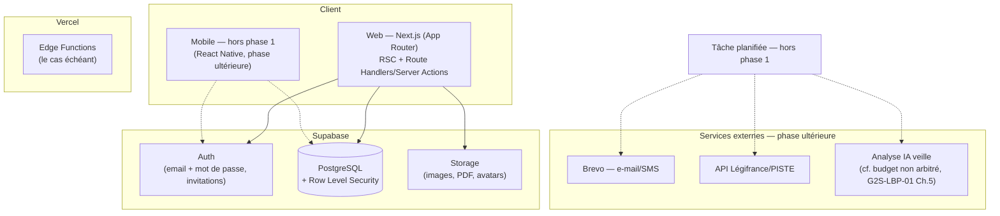
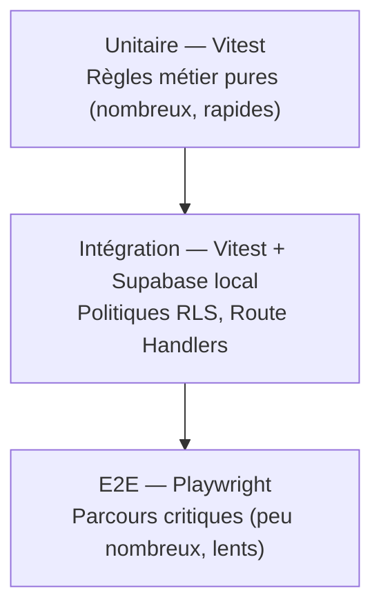
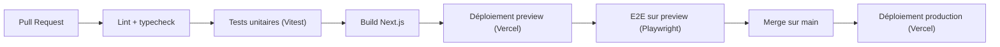

# Architecture cible — Livre Blanc de la Paie (LBP)

**Statut : proposition d'architecture, non validée par la direction
technique (Almamy CAMARA).** Ce document décrit l'architecture de
reconstruction du LBP en application web (et mobile, en phase ultérieure),
en remplacement du prototype `LBP_V2-20.html` documenté dans
[`docs/front/SPEC-FRONT-0001.md`](front/SPEC-FRONT-0001.md). Le cahier
gouvernance [`docs/G2S-LBP-01.md`](G2S-LBP-01.md) reste la référence pour les
risques, la conformité RGPD et la roadmap ; ce document se concentre sur les
choix de structuration technique et n'y revient pas.

**Sources de cette proposition** : `Note de cadrage - LBP.pdf` (16/09/2026,
§03 Comment ?, §04 Conditions de réussite, §09 Rôles) pour le choix de stack
et le modèle de rôles ; `LBP_Cahier_des_charges_et_technique-3.pdf` (§3.4
modèle de données, §3.12 contrat d'API) pour le socle de données ; et
`SPEC-FRONT-0001.md` pour le découpage fonctionnel déjà validé par l'usage
dans le prototype. Toute proposition non directement traçable à une de ces
sources est signalée comme telle (`Proposition —`).

## 1. Principes directeurs

Trois principes guident chaque choix de ce document — pas comme des
étiquettes, mais comme des critères de décision concrets :

- **KISS (Keep It Simple)** : construire d'abord les **3 fonctionnalités
  jugées indispensables** par l'équipe [Note de cadrage, p.5] — Bibliothèque
  Synchro, Comptes Utilisateurs, REX & Quizz Équipe — plutôt que de
  reconstruire tout le périmètre du prototype d'un coup. Retenir un
  fournisseur unique (Supabase) plutôt qu'un back-end sur mesure, pour
  éviter de ré-implémenter authentification, RLS et stockage from scratch
  [Note de cadrage, §03, p.6]. Ne pas construire de RBAC plus fin que
  `ADMIN`/`CLIENT` tant que la matrice exacte des droits n'est pas tranchée
  par Pauline [Note de cadrage, p.13].
- **DRY (Don't Repeat Yourself)** : une seule source de vérité par
  préoccupation transverse — un seul module de moteur de dates (le
  prototype en a deux parallèles, voir §7.1), un seul jeu de tokens de
  design (repris tel quel du prototype, pas redérivé), une seule fonction
  de normalisation de recherche, un seul schéma de validation par entité
  métier partagé entre le formulaire et l'API.
- **TDD (Test-Driven Development)** : les règles métier pures déjà
  identifiées et stabilisées dans le prototype (moteur de dates,
  verrouillage de contenu par palier, normalisation de recherche, analyse du
  format de quiz) sont **portées avec leurs tests écrits en premier**,
  puisqu'elles sont déjà spécifiées et vérifiables indépendamment de toute
  interface (voir §8).

## 2. Stack retenue

**Option 1 du comparatif — Next.js + Supabase + Vercel — retenue**, notée
95 % dans le comparatif transmis, contre 70 % pour l'option Firebase/Docker ;
la troisième option (back-end sur mesure Node/NestJS + PostgreSQL) n'est pas
chiffrée [Note de cadrage, §03, p.6]. Justification reprise de la source :
_« déjà le choix documenté au cahier technique (code d'authentification
écrit pour Supabase) et le mieux noté du comparatif sur la rapidité de
développement, la scalabilité et l'absence de verrouillage propriétaire
fort »_ [Note de cadrage, p.6].



## 3. Frontière du MVP (phase 1) — appliquer KISS

Les 3 fonctionnalités retenues comme indispensables [Note de cadrage, p.5]
définissent le périmètre du premier livrable :

| #   | Fonctionnalité       | Description source                                                                                                                                                       | Modules concernés                                                                                                                                                    |
| --- | -------------------- | ------------------------------------------------------------------------------------------------------------------------------------------------------------------------ | -------------------------------------------------------------------------------------------------------------------------------------------------------------------- |
| ①   | Bibliothèque Synchro | _« Base documentaire interconnectée en temps réel avec l'ensemble des modules du site. Et mise à jour en temps réel de la veille réglementaire »_ [Note de cadrage, p.5] | `features/bibliotheque`, `features/veille` (lecture seule côté client en phase 1 — l'automatisation de la collecte reste hors phase 1, voir Ch.6 de `G2S-LBP-01.md`) |
| ②   | Comptes Utilisateurs | _« Accès personnalisés RH, personnalisation du profil et suivi des préférences de contenu »_ [Note de cadrage, p.5]                                                      | `features/auth`, `features/compte`                                                                                                                                   |
| ③   | REX & Quizz Équipe   | _« Tableau de bord de suivi de la progression et des résultats des équipes sur les quiz »_ [Note de cadrage, p.5]                                                        | `features/quiz`                                                                                                                                                      |

**Explicitement reporté après la phase 1** (pas supprimé — reporté, par
application du principe KISS) : automatisation de la veille réglementaire à
10h30, envoi e-mail/SMS, application mobile, notifications push, gestion
documentaire avec upload réel, widget d'assistance connecté à un canal réel,
import Word côté serveur. Ces éléments restent spécifiés au cahier des
charges (§3.5 à §3.8) et repris comme dette au chapitre 6 de
`G2S-LBP-01.md` — ce document ne les retire pas de la cible, il les
séquence.

**Conditions de réussite non négociables** posées par la note de cadrage et
qui s'appliquent dès la phase 1, quel que soit le séquencement des
fonctionnalités [Note de cadrage, §04, p.7] : persistance réelle des
données, authentification opérationnelle et conforme RGPD, autonomie de
gestion de Pauline en mode Édition G2S, validation humaine avant toute
publication, respect strict des deux modes Client/Édition G2S et de leur
matrice de droits.

## 4. Découpage modulaire

**Architecture orientée fonctionnalité (« feature-based »), pas orientée
type de fichier.** Chaque domaine identifié dans `SPEC-FRONT-0001.md` §4
(déjà validé par l'usage dans le prototype) devient un module autonome,
plutôt que de disperser composants/hooks/appels API dans des dossiers
transverses `components/`, `hooks/`, `services/` où les dépendances entre
domaines redeviennent invisibles.

```
lbp/
├── app/                          # Next.js App Router — pages = composition, pas de logique métier
│   ├── (client)/                 # routes accessibles au rôle CLIENT
│   ├── (admin)/                  # routes accessibles au rôle ADMIN (édition G2S)
│   └── api/                      # Route Handlers minces — délèguent à features/*/server
├── features/
│   ├── auth/                     # ② Comptes Utilisateurs
│   │   ├── ui/                   # composants (formulaire de connexion, etc.)
│   │   ├── server/                # actions serveur (invitation, reset mot de passe)
│   │   ├── model.ts               # types + schéma de validation (source unique, DRY)
│   │   └── auth.test.ts
│   ├── bibliotheque/              # ① Bibliothèque Synchro
│   │   ├── ui/
│   │   ├── server/
│   │   ├── model.ts
│   │   └── bibliotheque.test.ts
│   ├── quiz/                      # ③ REX & Quizz Équipe
│   │   ├── ui/
│   │   ├── server/
│   │   ├── parse-quiz.ts          # port direct de parseQuiz() du prototype — pur, testé en premier
│   │   ├── parse-quiz.test.ts
│   │   └── quiz.test.ts
│   ├── veille/                    # lecture seule en phase 1
│   ├── calendrier/                # hors phase 1 — regroupe RH_CAL + CAL_BASE en un seul moteur (voir §7.1)
│   ├── chiffres-paie/              # hors phase 1
│   └── equipe/                     # hors phase 1
├── lib/                            # DRY : tout ce qui est partagé entre ≥ 2 features
│   ├── design-tokens.ts            # port 1:1 des variables :root du prototype
│   ├── supabase/                   # client Supabase (browser + server), typé depuis le schéma DB
│   ├── date-engine/                 # UNIQUE moteur de récurrence (fixe, mensuelle, nième jour, Pâques)
│   │   └── date-engine.test.ts      # porté et testé en premier (règle pure, déjà spécifiée)
│   └── search/
│       └── normalize.ts             # port de normText() — UNIQUE fonction de normalisation
├── ui-kit/                          # composants génériques réutilisables (bouton, carte, badge, modale)
│   └── (constat SPEC-FRONT-0001 §4 : n'existe pas dans le prototype — à construire dès la phase 1)
└── tests/
    ├── e2e/                         # Playwright — parcours critiques (voir §8.3)
    └── setup/
```

**Règle de frontière stricte (DRY appliqué à l'architecture elle-même)** :
un module de `features/` ne peut pas importer directement le code interne
d'un autre module de `features/` — seul `lib/` et `ui-kit/` sont partageables.
Si deux features ont besoin de la même logique, elle migre vers `lib/`. Cette
règle rend visible, dans l'arborescence elle-même, toute dépendance croisée
non désirée — le genre de duplication silencieuse constatée dans le
prototype entre `RH_CAL` et `CAL_BASE` (§7.1) ne peut plus se reproduire
sans que le déplacement du code vers `lib/` soit explicite et revu.

## 5. Couche de données

Reprise du modèle de données proposé au cahier des charges [§3.4, p.15],
priorisé pour la phase 1 :

| Table                                                                                         | Nécessaire en phase 1                                                          | Fonctionnalité |
| --------------------------------------------------------------------------------------------- | ------------------------------------------------------------------------------ | -------------- |
| `companies`, `establishments`                                                                 | Oui (cloisonnement RLS)                                                        | ②              |
| `profiles` (1-1 `auth.users`, champ `role` ADMIN/CLIENT)                                      | Oui                                                                            | ②              |
| `families`, `themes`, `fiches`                                                                | Oui                                                                            | ①              |
| `veille`                                                                                      | Oui en lecture (alimentation manuelle G2S en phase 1, automatisation reportée) | ①              |
| `quiz_scores`                                                                                 | Oui                                                                            | ③              |
| `team_members`, `calendar_events`, `tasks`, `articles`, `notifications`, `chiffres`, `offers` | Reporté (features hors phase 1)                                                | —              |

**RBAC phase 1** : deux rôles seulement, conformément à la décision déjà
actée [Note de cadrage, §09, p.13] — `ADMIN` (Pauline, droits d'édition et de
publication complets) et `CLIENT` (profils RH, consultation du contenu
publié + personnalisation de leurs propres données). _La matrice exacte des
droits reste, à ce stade, un point de précision à trancher avec Pauline_
[Note de cadrage, p.13] — ne pas anticiper de rôles supplémentaires tant que
cet arbitrage n'est pas rendu (principe KISS).

Cloisonnement multi-sociétés : chaque table métier porte une colonne
`company_id`, avec une politique RLS PostgreSQL qui restreint un `CLIENT` à
sa propre société et autorise un `ADMIN` à traverser toutes les sociétés
[Cahier des charges §3.4-§3.5, p.15-16]. C'est une condition de réussite non
négociable [Note de cadrage, §04, p.7 ; §05, p.8 — « aucune gestion
multi-sociétés réelle » classée risque bloquant].

## 6. Couche API

Le contrat d'API proposé au cahier des charges [§3.12, p.38-39] est repris,
réduit aux endpoints nécessaires à la phase 1 (les autres restent
documentés au cahier des charges pour les phases suivantes, pas dupliqués
ici) :

| Endpoint (phase 1)                                 | Fonctionnalité             | Implémentation Next.js                                         |
| -------------------------------------------------- | -------------------------- | -------------------------------------------------------------- |
| `POST /onboarding`                                 | ② — invitation d'un client | Server Action, appelle `supabase.auth.admin.inviteUserByEmail` |
| `GET/POST/PUT /fiches`, `POST /fiches/:id/publish` | ①                          | Route Handler + RLS Supabase                                   |
| `GET /veille/links`                                | ① (lecture)                | Route Handler                                                  |
| `GET/POST /quizzes`, écriture de `quiz_scores`     | ③                          | Server Action                                                  |
| `GET/PUT /company`, `/profile`                     | ②                          | Server Action                                                  |

Convention DRY : chaque endpoint partage son schéma de validation
(`zod`, ou équivalent) avec le formulaire correspondant en `features/*/ui`
— une seule définition de la forme d'un objet métier, jamais une validation
dupliquée entre le client et le serveur.

## 7. Points de vigilance hérités du prototype

### 7.1 Fusionner les deux moteurs de calendrier (DRY)

Le prototype porte **deux jeux de données de calendrier parallèles**,
`RH_CAL` (jours fériés fixes, utilisés par le widget compact de l'accueil)
et `CAL_BASE` (moteur de récurrence complet à 5 types de règles, utilisé par
l'onglet Calendrier RH complet), avec deux pipelines de rendu distincts
(`renderCalendar()` vs `renderCalFull()`) [`SPEC-FRONT-0001.md` §7]. Ce
module étant hors phase 1, la recommandation est de **ne pas reproduire
cette duplication** lors de sa reconstruction : un seul module
`lib/date-engine` couvrant les 5 types de récurrence déjà spécifiés au
cahier des charges [§3.11.2, p.37], consommé à la fois par un composant
« widget compact » et un composant « vue complète » qui ne diffèrent que par
leur présentation, pas par leurs données.

### 7.2 Ne pas reproduire le verrouillage de contenu incomplet

Le verrouillage de contenu par palier commercial ne couvre aujourd'hui que
1 niveau de lecture sur 5 (`SPEC-FRONT-0001.md` §7 ; `LBP_V2-20.html`, lignes
2478-2483) alors que l'offre commerciale promet un verrouillage à 3 couches
(Réglementation / Convention collective / Accords). Dans le modèle de
données cible, ce verrouillage doit être porté par une règle serveur (RLS ou
vérification dans le Route Handler), pas seulement par une condition
d'affichage côté client comme dans le prototype — sans quoi le contournement
resterait aussi trivial qu'aujourd'hui (modification d'une variable
JavaScript côté client).

## 8. Stratégie de test (TDD)

### 8.1 Pyramide de tests



### 8.2 Règles métier pures à porter en TDD strict

Ces règles sont **déjà spécifiées et stabilisées** dans le prototype — elles
n'ont pas besoin d'interface pour être testées, donc leurs tests peuvent
être écrits avant le portage lui-même :

| Règle                                         | Origine dans le prototype          | Cas de test dérivés directement de sources déjà vérifiées                                                                                                                                                      |
| --------------------------------------------- | ---------------------------------- | -------------------------------------------------------------------------------------------------------------------------------------------------------------------------------------------------------------- |
| Moteur de dates (5 types de récurrence)       | `LBP_V2-20.html`, lignes 1397-1421 | Pâques 2026 = 5 avril, Pâques 2027 = 28 mars, Ascension toujours un jeudi, Pentecôte toujours un lundi [Cahier des charges §3.11.2, p.37] ; DSN le 5 exclue pour une entreprise `<11` salariés [§3.11.4, p.38] |
| Verrouillage de contenu par palier            | `LBP_V2-20.html`, lignes 2478-2523 | Un palier 1 ne voit pas le niveau `detail` ; **corriger** le cas actuellement non couvert (`comprendre` accessible à tous les paliers) en écrivant d'abord le test qui l'exige                                 |
| Normalisation de recherche                    | `LBP_V2-20.html`, ligne 2757       | `normalize("congés") === normalize("conges")`                                                                                                                                                                  |
| Analyse du format de quiz (texte → questions) | `LBP_V2-20.html`, ligne 2852       | Le bloc d'exemple du cahier des charges [§1.7.3, p.12] comme fixture de test                                                                                                                                   |

### 8.3 Tests d'intégration et E2E

- **RLS Supabase** : chaque politique (cloisonnement par `company_id`, accès
  `ADMIN` vs `CLIENT`) testée avec le client de test Supabase local, pas
  seulement vérifiée manuellement — condition de réussite « authentification
  opérationnelle et RGPD » [Note de cadrage, p.7] non atteignable sans cela.
- **Parcours E2E prioritaires** (Playwright), directement dérivés des
  conditions de réussite [Note de cadrage, §04, p.7] : invitation → choix du
  mot de passe → connexion (②) ; publication d'une fiche en brouillon puis
  publiée, visible côté client seulement après publication (① — corrige
  explicitement le bug de publication déjà identifié et partiellement
  corrigé dans le prototype, `SPEC-FRONT-0001.md` §7) ; passage d'un quiz et
  calcul du score (③).

### 8.4 Outils proposés

`Vitest` (unitaire/intégration, compatible Next.js), `@testing-library/react`
(composants), `Playwright` (E2E), tests RLS via le CLI Supabase
(`supabase test db` / pgTAP). _Proposition — aucun de ces choix d'outillage
n'est imposé par une source du projet ; à valider par la direction
technique._

## 9. Pipeline CI/CD proposé

Aucun pipeline n'existe à ce jour (`SPEC-FRONT-0001.md` §8 — absence de
dépôt git). Proposition minimale, alignée sur la stack retenue :



_Proposition — à faire valider et compléter par la direction technique une
fois le dépôt git créé ; aucune source du projet ne spécifie encore
d'outillage CI/CD._

## 10. Plan de migration depuis le prototype

| Élément du prototype (`SPEC-FRONT-0001.md`)              | Devenir dans l'architecture cible                                                                                                                           |
| -------------------------------------------------------- | ----------------------------------------------------------------------------------------------------------------------------------------------------------- |
| Variables CSS `:root` (palette, typographie)             | `lib/design-tokens.ts`, portées 1:1 — aucune couleur ajoutée, conformément à la charte [Cahier des charges §3.9, p.17]                                      |
| `goView()` + 13 `<div class="view">`                     | Routes Next.js App Router (`app/(client)/...`, `app/(admin)/...`)                                                                                           |
| `FAMILIES`/`THEMES`/`SUBTHEMES`/`FICHES`/`FICHE_META`    | Tables `families`, `themes`, `fiches` (Supabase) + `features/bibliotheque`                                                                                  |
| `PROFILES`/`COMPANY` (données figées)                    | Tables `profiles`/`companies` + `features/auth`                                                                                                             |
| `QUIZZES`/`QZSCORES`/`parseQuiz()`                       | Table `quiz_scores` + `features/quiz`, `parseQuiz()` porté tel quel avec ses tests (§8.2)                                                                   |
| `RH_CAL` + `CAL_BASE` (dupliqués)                        | `lib/date-engine` unique (§7.1) — hors phase 1                                                                                                              |
| Verrouillage de contenu client uniquement (`tier`/`req`) | Règle serveur (RLS ou Route Handler), pas uniquement une condition d'affichage (§7.2)                                                                       |
| 2 formulaires Netlify (`offre-lbp`, `contact-lbp`)       | À remplacer par des Server Actions Next.js écrivant en base (avec finalité et durée de conservation documentées — point ouvert, `G2S-LBP-01.md` Chapitre 5) |

## 11. Arbitrages ouverts, non tranchés par ce document

- Matrice exacte des droits `ADMIN`/`CLIENT` au-delà du principe posé — à
  trancher avec Pauline [Note de cadrage, p.13].
- Choix du modèle d'analyse IA pour la veille réglementaire (coût non
  arbitré entre les options du budget indicatif — voir `G2S-LBP-01.md`
  Chapitre 5) — hors phase 1, sans impact sur ce document.
- Outillage de test précis (§8.4) et détail du pipeline CI/CD (§9) —
  proposition, à valider par la direction technique.
- Date de bascule vers l'application mobile (React Native) — non planifiée
  dans ce document, la note de cadrage la mentionne sans date [§03, p.6].

## Historique des versions

| Version | Date       | Auteur         | Contenu                                                                                                                                                           |
| ------- | ---------- | -------------- | ----------------------------------------------------------------------------------------------------------------------------------------------------------------- |
| 0.1.0   | 2026-09-16 | James Ahmedaly | Première proposition — architecture cible Next.js/Supabase/Vercel, découpage modulaire, stratégie TDD, plan de migration. Non validée par la direction technique. |
