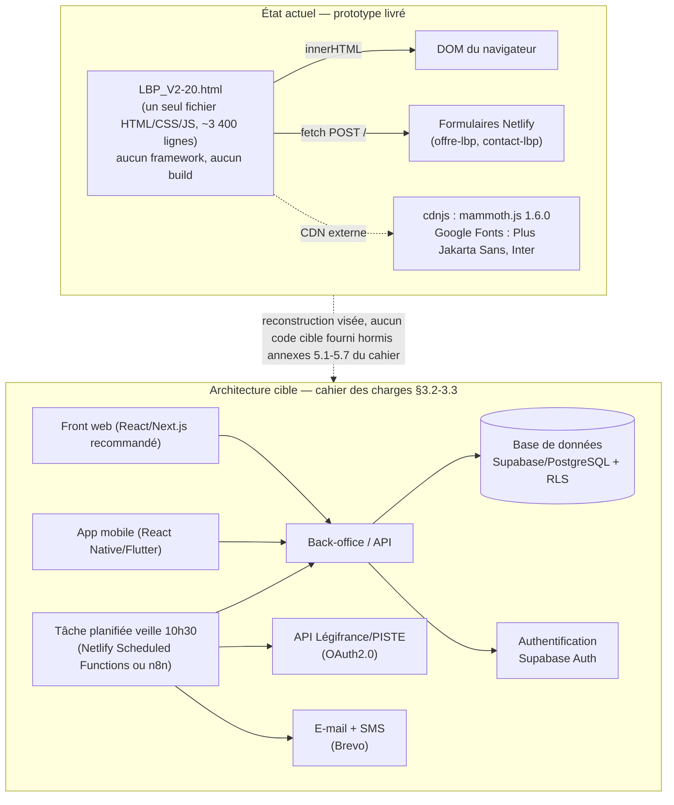

# G2S-LBP-01 — Cahier technique du Livre Blanc de la Paie (LBP)

> Cahier technique gouvernance, norme interne **G2S-STD-DOC-01**. Ce document ne
> remplace pas une documentation technique exhaustive par domaine
> (`SPEC-FRONT-000X`) : il synthétise sous un angle gouvernance / risques /
> RGPD / transmissibilité. **Aucune `SPEC-FRONT-0001` n'existe à ce jour** pour
> le frontend du LBP — c'est un manque identifié par ce cahier lui-même (voir
> Chapitre 6, dette documentaire) plutôt qu'une omission de rédaction.
>
> **Sources exploitées pour l'amorçage** (toutes situées dans
> `projet-lbp/`, sauf mention contraire) :
>
> - `LBP_Cahier_des_charges_et_technique-3.pdf` (49 p., document interne du 7 août 2026) — cahier des charges fonctionnel et technique de référence.
> - `Compte Rendu de Réunion - Le Livre Blanc de la Paie.pdf` (11 p., document du 04/08/2026) — cadrage stratégique et feuille de route.
> - `LBP_V2-20.html` (le prototype lui-même — code source inspecté directement, ligne par ligne, pour tous les faits techniques de ce cahier).
> - `moscow-lbp.html` — outil de priorisation MoSCoW (fonctionnalités cataloguées, état de tri).
> - `RAPPORT_VERIFICATION_CONSTATS_TERRAIN.md` (9 septembre 2026) — vérification de 9 constats de terrain dans le code d'une version antérieure du prototype (`copie_LBP.html`), recoupée par nous avec le code actuel de `LBP_V2-20.html`.
> - `MODIFICATIONS_LBP_V2-20.md` (8 septembre 2026) — liste des corrections d'accessibilité WCAG 2.1 AA appliquées à `LBP_V2-20.html`, elle-même issue de `Rapport d'Expertise UI_UX et Audit d'Accessibilité - LBP Référentiel Paie.md` (non relu directement pour ce cahier — cité ici par transitivité, à vérifier si une preuve de premier niveau est nécessaire).
>
> Non exploités à ce stade (hors périmètre de cette amorce, à intégrer dans une
> future révision si jugé utile) : `Comparatif Tech Stack.pdf`, `Note de
cadrage - LBP.pptx`, `Rapport_Prix_IA_RAG_n8n (1).docx`,
> `Constats_de_terrain_LBP.html`, `copie_LBP.html`, `lbp-v2.html`,
> `index.html.bak`, `V7 SITE_INTERNET_V2_accueil-18.html`, `model1.md`,
> `model2.md`.

## 0. Statut de recevabilité — à lire avant tout le reste

Règle transversale obligatoire de la norme : **aucun chapitre technique
(architecture, flux, sécurité, reprise CTO) ne peut démarrer sans que
l'apport correspondant ait été fourni par son pilote — à défaut, le document
est non opposable.**

Ce cahier est un **amorçage par extraction automatisée** (IA) à partir des
sources listées ci-dessus. Aucun pilote nommé ne l'a encore relu ni validé.
Il reste un **brouillon de travail**.

| Chapitre                       | Contenu technique extrait                                          | Validation pilote reçue                                                                   | Opposable ? |
| ------------------------------ | ------------------------------------------------------------------ | ----------------------------------------------------------------------------------------- | ----------- |
| 1. Résumé exécutif             | Partielle (chiffres extraits, arbitrages en attente)               | ❌ Porteur produit (Pauline LETOURNEUR) + référents métier (James AHMEDALY, Nicolas SECK) | Non         |
| 2. Périmètre et positionnement | Oui (cahier des charges + compte-rendu)                            | ❌ Référents métier/fonctionnel (James AHMEDALY, Nicolas SECK)                            | Non         |
| 3. Architecture technique      | Oui (code source inspecté directement)                             | ❌ Direction technique (Almamy CAMARA)                                                    | Non         |
| 4. Intelligence métier         | Oui (code source + cahier des charges)                             | ❌ Direction technique (Almamy CAMARA) + référents métier (James AHMEDALY, Nicolas SECK)  | Non         |
| 5. Sécurité et RGPD            | Partielle (constats factuels ; arbitrages juridiques non tranchés) | ❌ Porteur produit (Pauline LETOURNEUR) + référent juridique (Pauline LETOURNEUR)         | Non         |
| 6. Risques et transmissibilité | Oui (cahier des charges §6 + vérification code)                    | ❌ Direction technique (Almamy CAMARA) + porteur produit (Pauline LETOURNEUR)             | Non         |
| 7. Roadmap et évolution        | Partielle (feuille de route connue ; MoSCoW non exécuté)           | ❌ Direction technique (Almamy CAMARA) + porteur produit (Pauline LETOURNEUR)             | Non         |

**Rôles nommés pour ce projet** (communiqués le 2026-09-16) :

- **Direction technique** : Almamy CAMARA
- **Référent métier / fonctionnel** : James AHMEDALY, Nicolas SECK
- **Référent juridique** : Pauline LETOURNEUR
- **Porteur produit** : Pauline LETOURNEUR

Le document ne devient opposable qu'une fois toutes les cases cochées par
leurs pilotes respectifs.

---

## Gabarit interne à chaque chapitre

Chaque chapitre répond aux questions **Pourquoi / Comment / Valeur**, dans
l'ordre : Introduction, Architecture, Fonctionnement, Interactions, Données,
Limites et perspectives, Preuves.

## Chapitre 1 — Résumé exécutif

**Pilotes :** porteur produit (Pauline LETOURNEUR) + référents métier (James
AHMEDALY, Nicolas SECK) — chapitre rédigé en dernier par construction ; ici
amorcé par extraction, **à réécrire par ses pilotes une fois les chapitres 2 à
7 stabilisés**.

### Introduction

Le « Livre Blanc de la Paie » (LBP) est un projet porté par G2S visant à
créer _« la plateforme de référence pour documenter et accompagner l'ensemble
des professionnels de la paie et des ressources humaines »_, présentée en
interne comme _« la Bible des RH »_ [Compte-rendu, p.3-4]. Il doit remplacer
l'usage actuel de Notion, jugé non pérenne et peu personnalisable
[Compte-rendu, p.3]. Livraison cible annoncée : **20 octobre 2026**
[Compte-rendu, p.1, p.4, p.9]. Porteuse de projet désignée dans le
compte-rendu : Pauline [Compte-rendu, p.1].

### Architecture — état du produit

Le seul livrable technique actuellement disponible est un **prototype
front-end autonome** : `LBP_V2-20.html`, un unique fichier HTML/CSS/JavaScript
sans framework ni backend [Cahier des charges §3.1, p.15 ; confirmé par
inspection directe du fichier]. Aucun code de back-office, base de données ou
application mobile n'existe à ce jour dans le dossier de travail transmis.

### Fonctionnement — ce que le prototype démontre

Le prototype couvre 13 écrans, une bibliothèque de **3 familles / 18 thèmes /
139 sous-fiches** [Cahier des charges §1.4.1, p.9], **4 offres commerciales**
(de 149 € HT à « à partir de 990 € HT sur devis ») [`LBP_V2-20.html`, objet
`OFFERS`, lignes 2566-2587], un calendrier RH avec moteur de dates couvrant
**~70 règles de récurrence produisant ~100 occurrences par an** [Cahier des
charges §3.11.3, p.37], un module de veille réglementaire sur **7 sources
officielles** (non automatisé à ce stade — voir Chapitre 6), un module quiz,
et un organigramme avec **124 avatars** illustrés [Cahier des charges §1.3.2,
p.9].

### Données — chiffres clés vérifiables

Repères paie intégrés au prototype, avec base légale citée dans le code
[`LBP_V2-20.html`, objet `CHIFFRES`, lignes 2101-2127] :

| Repère                                  | Valeur 2026 | Source citée dans le code           |
| --------------------------------------- | ----------- | ----------------------------------- |
| SMIC horaire brut (1er juin 2026)       | 12,31 €     | Arrêté du 22 mai 2026 (JO du 24/05) |
| SMIC mensuel brut (35 h)                | 1 867,02 €  | Idem                                |
| Plafond mensuel Sécurité sociale (PMSS) | 4 005 €     | Arrêté du 22 décembre 2025          |
| Plafond annuel Sécurité sociale (PASS)  | 48 060 €    | Idem                                |

Ces valeurs sont codées en dur dans le prototype (aucune base de données) et
devront être reprises dans le référentiel cible (Chapitre 4 et 7).

### Interactions — arbitrage produit en cours

Un arbitrage MoSCoW (Must/Should/Could/Won't) des fonctionnalités a été
annoncé pour « septembre 2026 » [Compte-rendu, p.9]. L'outil dédié existe
(`moscow-lbp.html`, 51 fonctionnalités cataloguées en 12 catégories) mais,
dans le fichier fourni, **la totalité des 51 éléments est encore à l'état
« backlog » (à trier)** — aucun n'est marqué Must, Should, Could ou Won't
[`moscow-lbp.html`, tableau `SEED_ITEMS`, tous initialisés
`priority:'backlog'`, lignes 196-259]. **Le périmètre du MVP à livrer le
20/10/2026 n'est donc pas encore arbitré** à la date de cette amorce.

### Limites et perspectives

Le cahier des charges lui-même recense **17 points de risques ou travaux non
finalisés** [Cahier des charges §6, p.33-36], dont trois qualifiés
bloquants par nous sur la base de leur description (absence de persistance,
authentification non opérationnelle, absence de cloisonnement multi-sociétés)
— voir Chapitre 6 pour le détail et les preuves. Le compte-rendu de réunion
qualifie lui-même le périmètre démontré de _« trop étendu pour cette phase
initiale »_ [Compte-rendu, p.5], ce qui corrobore la nécessité de l'arbitrage
MoSCoW encore non réalisé.

**[À COMPLÉTER — porteur produit / référents métier]** : validation de cette
synthèse, arbitrage du périmètre MVP réellement engagé pour le 20/10/2026,
confirmation ou correction des chiffres ci-dessus.

### Preuves

| ID       | Élément                                                                    | Référence                                         |
| -------- | -------------------------------------------------------------------------- | ------------------------------------------------- |
| PR-C1-01 | Vision produit et échéance de livraison                                    | Compte-rendu, p.1, p.3-4, p.9                     |
| PR-C1-02 | Périmètre fonctionnel du prototype (13 écrans, 18 thèmes, 139 sous-fiches) | Cahier des charges §1.4.1, p.9 ; `LBP_V2-20.html` |
| PR-C1-03 | Offres commerciales                                                        | `LBP_V2-20.html`, lignes 2566-2587                |
| PR-C1-04 | Chiffres paie 2026 et sources légales                                      | `LBP_V2-20.html`, lignes 2101-2127                |
| PR-C1-05 | Arbitrage MoSCoW non réalisé (51/51 en backlog)                            | `moscow-lbp.html`, lignes 196-259                 |
| PR-C1-06 | 17 points de risques déclarés                                              | Cahier des charges §6, p.33-36                    |

## Chapitre 2 — Périmètre et positionnement

**Pilote :** référents métier/fonctionnel (James AHMEDALY, Nicolas SECK).

### Introduction

Ce chapitre définit ce que le LBP adresse, pour qui, et — tout aussi
important selon la norme — ce qu'il n'adresse explicitement pas à ce stade.

### Architecture fonctionnelle — cas d'usage couverts

Le cahier des charges fonctionnel décrit, page par page, les modules suivants
[Cahier des charges §1, p.8-13] :

| Module                          | Contenu                                                                                                                                    | Référence      |
| ------------------------------- | ------------------------------------------------------------------------------------------------------------------------------------------ | -------------- |
| Accueil                         | Bandeau, rappels de semaine interactifs, calendrier compact, chiffres clés, deux blocs d'actualités, rappel des 3 familles de bibliothèque | §1.2, p.8-9    |
| Mon équipe                      | Identité société, organigramme (124 avatars), organisation de la paie, outils RH, documents (CC, accords, grille de salaire)               | §1.3, p.9      |
| La bibliothèque                 | 3 familles → 18 thèmes → 139 sous-fiches, fiche en 3 niveaux de lecture (En bref / Comprendre / Dans le détail) + vigilance + quiz         | §1.4, p.9-10   |
| Actu · Décrypt RH&Paie          | Grille d'articles/dossiers PDF, pagination 5/page, édition avec workflow brouillon→publication                                             | §1.5, p.11     |
| Chiffres Paie                   | Comparatif N-1→N, plafonds toutes périodicités, taux de cotisations                                                                        | §1.6, p.11     |
| Quizz                           | Quiz issus de fiches + quiz autonomes, import Word/texte au format normé                                                                   | §1.7, p.11-12  |
| Offres                          | Présentation et détail des 4 offres commerciales                                                                                           | §1.8, p.12     |
| Veille réglementaire (mode G2S) | 7 sources officielles suivies, rapprochement/création de fiche, notification quotidienne 10h30                                             | §1.9, p.12     |
| Prise en main                   | Aide contextuelle et bloc vidéo                                                                                                            | §1.10, p.12    |
| Mon compte                      | Infos perso, identifiants, préférences de notification                                                                                     | §1.11, p.12-13 |
| Notifications                   | Cloche, deux audiences (client/G2S)                                                                                                        | §1.12, p.13    |
| Recherche globale               | Recherche transversale LBP + liens sources officielles                                                                                     | §1.13, p.13    |
| Assistance                      | Widget de chat                                                                                                                             | §1.14, p.13    |

Droits d'accès : matrice à deux modes (Client / G2S-éditeur) formalisée
[Cahier des charges §2.1, p.14], avec principe de publication brouillon →
publié déclenchant notification [§2.2, p.14].

### Fonctionnement — problème métier adressé

_« Le Livre Blanc de la Paie vise à créer la plateforme de référence pour
documenter et accompagner l'ensemble des professionnels de la paie et des
ressources humaines »_ [Compte-rendu, p.3]. Constat de départ : recours
systématique à Notion, solution externe non propriétaire, jugée coûteuse et
limitée en personnalisation [Compte-rendu, p.3].

### Interactions — un positionnement encore en discussion

Deux sources donnent une image **non totalement alignée** du modèle de
droits, à faire trancher par les pilotes plutôt que résolue arbitrairement
ici :

- le cahier des charges du 7 août 2026 ne décrit que deux modes, Client et
  G2S-éditeur [§2.1, p.14, §0.4, p.7] ;
- le compte-rendu du 04/08/2026 anticipe déjà un modèle **RBAC** plus fin à
  deux rôles nommés différemment — **ADMIN** (Pauline uniquement) et
  **CLIENT** (profils RH) — en précisant lui-même qu'un _« point de précision
  [est] nécessaire pour définir la matrice exacte des droits »_ [Compte-rendu,
  p.7].

**Hors périmètre explicite**, d'après le cahier des charges lui-même [§6.16,
p.35-36] :

- Facturation et paiement des abonnements (la souscription est traitée comme
  un simple événement d'entrée ; le paiement est hors périmètre).
- Statistiques d'usage (à définir avec G2S, avec précautions de
  confidentialité).
- Export PDF d'une fiche ou d'un ensemble de fiches (souhaitable, non
  maquetté).
- Gestion multilingue (produit conçu en français uniquement).
- Signature électronique et flux contractuels.

**Hors périmètre non tranché** (constat, pas une décision) : le compte-rendu
qualifie lui-même le périmètre actuellement démontré de _« trop étendu pour
cette phase initiale »_, nécessitant un _« travail rigoureux de tri et de
rationalisation des fonctionnalités [...] pour isoler le cœur de valeur »_
[Compte-rendu, p.5]. L'outil de priorisation MoSCoW existe mais n'a pas encore
été exécuté (voir Chapitre 1) : le frontière exacte du MVP livrable au
20/10/2026 reste donc **à définir par les référents métier**, pas déductible
des sources actuelles.

### Limites et perspectives

Le compte-rendu identifie 3 fonctionnalités jugées prioritaires par les
parties prenantes au 04/08/2026 (avant tout arbitrage MoSCoW formel) :
**Bibliothèque Synchro**, **Comptes Utilisateurs**, **REX & Quizz Équipe**
[Compte-rendu, p.8]. Ces trois items ne préjugent pas du résultat de
l'arbitrage MoSCoW à mener.

**[À COMPLÉTER — référents métier]** : trancher le modèle de rôles
(2 modes vs RBAC fin), exécuter l'arbitrage MoSCoW, confirmer le périmètre du
MVP du 20/10/2026.

### Preuves

| ID       | Élément                                        | Référence                                       |
| -------- | ---------------------------------------------- | ----------------------------------------------- |
| PR-C2-01 | Cahier fonctionnel complet (§1.1 à §1.14)      | Cahier des charges, p.8-13                      |
| PR-C2-02 | Matrice des droits et principe de publication  | Cahier des charges §2, p.14                     |
| PR-C2-03 | Constat de périmètre trop étendu               | Compte-rendu, p.5                               |
| PR-C2-04 | Ambiguïté du modèle de rôles (2 modes vs RBAC) | Cahier des charges §2.1/§0.4 ; Compte-rendu p.7 |
| PR-C2-05 | Hors périmètre explicite (§6.16)               | Cahier des charges, p.35-36                     |
| PR-C2-06 | Arbitrage MoSCoW non exécuté                   | `moscow-lbp.html`, lignes 196-259               |

## Chapitre 3 — Architecture technique

**Pilotes :** équipe dev — validation direction technique (Almamy CAMARA).

### Introduction

Ce chapitre décrit l'architecture **réellement observable** du prototype
livré (`LBP_V2-20.html`), et la met en regard de l'architecture cible décrite
au cahier des charges. Aucun code de back-office, base de données ou
application mobile n'existe dans les sources fournies : ce chapitre ne porte
donc que sur le front-end prototype et sur des recommandations documentées
mais non implémentées.

### Architecture — schéma directeur

Sources : composition de l'existant établie par inspection directe de
`LBP_V2-20.html` ; architecture cible reprise de [Cahier des charges §3.2-3.3,
p.15].

### Fonctionnement — le prototype en détail

**Absence totale de framework et de build.** Un seul fichier HTML contient le
balisage, tout le CSS (variables de thème en `:root`) et tout le JavaScript
(~3 400 lignes). Aucune dépendance `npm`/`package.json` : la seule ressource
externe chargée est `mammoth.js` (`cdnjs.cloudflare.com/ajax/libs/mammoth/
1.6.0/mammoth.browser.min.js`, ligne 3223) pour l'import de fichiers Word, et
les polices Google Fonts _Plus Jakarta Sans_ / _Inter_.

**Routage applicatif.** Chaque écran est un `
`
; la fonction `goView(nom)` masque tous les écrans, affiche celui demandé, met
à jour l'onglet actif de la barre de navigation et gère une pile d'historique
pour le bouton retour (`viewHistory`, ligne 1270). **13 écrans** sont
recensés : overview, documents, docdetail, biblio, fiche, decrypt, chiffres,
quiz, offres, offre-detail, veille, help, account, search.

**Rendu.** Chaque écran est reconstruit à la demande par une fonction dédiée
(`renderOverview()`, `renderBiblio()`, `renderChiffres()`, `renderVeille()`,
etc.) qui génère une chaîne HTML injectée via `innerHTML` — pas de
composants, pas de diffing, pas de state manager. Ce choix explique
l'absence totale de dépendance mais aussi l'absence de tout mécanisme de
protection contre l'injection au-delà de la fonction d'échappement manuelle
`escHtml()`/`escAttr()` (lignes 2756, 2851), dont la couverture n'a pas été
vérifiée systématiquement sur l'ensemble des points d'insertion.

**Modèle de permissions.** Une variable globale `appMode` (`'client'` |
`'g2s'`) pilote l'affichage. Le passage en mode G2S est gardé par une seule
condition côté client : `PROFILES[profile].dir === true`
(`function setMode`, ligne 1238-1239) — seul le profil `drh` (« Camille
Moreau ») a `dir:true` (ligne 1186). **Il n'existe aucune vérification
côté serveur** puisqu'il n'y a pas de serveur : n'importe quel utilisateur du
navigateur peut modifier la variable JavaScript `profile` ou `appMode`
directement dans la console pour accéder au mode édition. Ce n'est pas un
bug du prototype (qui n'a jamais eu vocation à porter une sécurité réelle),
mais un point de vigilance explicite pour la reconstruction (Chapitre 5).

**Système commercial de paliers.** Une variable `tier` (1 à 4, ligne 1231)
représente le palier souscrit. Les niveaux de lecture d'une fiche
(`LEVELS`, lignes 2478-2483) portent chacun un champ `req` (palier minimum
requis) comparé à `tier` (`const locked = tier < l.req`, ligne 2523) pour
verrouiller visuellement le contenu (icône 🔒, classe `.locked`). Ce
mécanisme est le seul verrou de contenu par offre commerciale présent dans le
prototype.

**Design system.** Palette de couleurs et typographies définies en variables
CSS `:root`, avec le commentaire explicite dans le code : _« Palette
strictement identique à lbp-vitrine.html — aucune couleur ajoutée »_
(`LBP_V2-20.html`, ligne 12), confirmant l'alignement demandé au cahier des
charges [§3.9, p.17 : _« La charte est strictement alignée sur le site
vitrine G2S »_]. Polices : Plus Jakarta Sans (titres, 500-800) et Inter
(corps, 400-700).

### Interactions — les deux seuls flux réseau réels

Le prototype n'appelle aucune API applicative. Il ne réalise que deux appels
réseau, tous deux vers `/` en `POST` `application/x-www-form-urlencoded`
(convention _Netlify Forms_) :

| Fonction             | Formulaire    | Données envoyées                                                       | Ligne     |
| -------------------- | ------------- | ---------------------------------------------------------------------- | --------- |
| `sendOffreRequest()` | `offre-lbp`   | prénom, e-mail, entreprise, offre demandée, type de demande            | 2700-2706 |
| `sendChat()`         | `contact-lbp` | prénom, e-mail, entreprise, message libre saisi dans le widget de chat | 2737-2747 |

Ces deux flux sont les **seuls points où des données seraient réellement
transmises hors du navigateur** si le prototype était déployé tel quel (voir
Chapitre 5).

### Données — absence de persistance

Aucun appel à `localStorage`, `sessionStorage`, `indexedDB` ou `fetch` vers
une API de données n'existe dans le code (vérifié par recherche exhaustive
sur l'ensemble du fichier). Toutes les données (fiches, articles, quiz,
offres, chiffres, calendrier, organigramme, notifications) vivent dans des
variables JavaScript globales (`FICHES`, `THEMES`, `SUBTHEMES`, `CHIFFRES`,
`OFFERS`, `TEAM`, `CAL_EVENTS`, `NOTIFS`, etc. — inventaire complet en
Chapitre 4 §Référentiels) réinitialisées à chaque rechargement de page. Ceci
confirme intégralement le constat du cahier des charges [§3.1, p.15 et §6.2,
p.33].

### Limites et perspectives

La reconstruction en architecture cible (front web + mobile + back-office +
base de données, cf. schéma ci-dessus) est **entièrement à faire** : aucun
code applicatif cible n'a été retrouvé dans les sources, à l'exception du
code d'automatisation de veille et d'authentification annoncé en annexes
5.1 à 5.7 du cahier des charges (non présent physiquement dans le dossier de
travail transmis — fichiers `veille-quotidienne.mjs`, `netlify.toml`,
`AUTH_*` absents du répertoire à la date de cette amorce). **Aucune
`SPEC-FRONT-0001` n'existe** pour documenter exhaustivement le design system
et les composants du prototype ; ce cahier n'en tient lieu qu'en synthèse
gouvernance, pas en référence technique complète (recommandation en
Chapitre 7).

### Preuves

| ID       | Élément                                                                             | Référence                                                                           |
| -------- | ----------------------------------------------------------------------------------- | ----------------------------------------------------------------------------------- |
| PR-C3-01 | Absence de framework, dépendance unique mammoth.js                                  | `LBP_V2-20.html`, ligne 3223                                                        |
| PR-C3-02 | 13 écrans et fonction de routage `goView()`                                         | `LBP_V2-20.html`, lignes 1031-1270                                                  |
| PR-C3-03 | Garde de mode G2S côté client uniquement                                            | `LBP_V2-20.html`, lignes 1185-1239                                                  |
| PR-C3-04 | Verrouillage de contenu par palier commercial                                       | `LBP_V2-20.html`, lignes 2478-2523                                                  |
| PR-C3-05 | Alignement charte graphique sur le site vitrine G2S                                 | `LBP_V2-20.html`, ligne 12 ; Cahier des charges §3.9, p.17                          |
| PR-C3-06 | Deux flux réseau réels (Netlify Forms)                                              | `LBP_V2-20.html`, lignes 2700-2747                                                  |
| PR-C3-07 | Absence de toute persistance (`localStorage`/`fetch` de données)                    | Recherche exhaustive sur `LBP_V2-20.html` ; Cahier des charges §3.1/§6.2, p.15/p.33 |
| PR-C3-08 | Architecture cible proposée                                                         | Cahier des charges §3.2-3.3, p.15                                                   |
| PR-C3-09 | Annexes de code (veille, authentification) non présentes dans le dossier de travail | Constat direct sur le répertoire `projet-lbp/`                                      |

## Chapitre 4 — Intelligence métier

**Pilotes :** direction technique (Almamy CAMARA) + référents métier (James
AHMEDALY, Nicolas SECK).

### Introduction

Ce chapitre documente les règles métier réellement codées dans le
prototype — la « logique paie/RH » qui constitue la valeur du produit,
indépendamment de son état d'industrialisation.

### Architecture — taxonomie des briques fonctionnelles

Grille de critères retenue : **N1** = référentiel de contenu consultable en
l'état, **N2** = contenu combiné à une règle de calcul ou de filtrage
paramétrable, **N3** = automatisation déclenchant une action métier
(notification, création de contenu).

| Niveau | Brique                        | Exemples                                                                                                                                                                                                                                         |
| ------ | ----------------------------- | ------------------------------------------------------------------------------------------------------------------------------------------------------------------------------------------------------------------------------------------------ |
| N1     | Contenu de référence statique | Fiches bibliothèque (`FICHES`), chiffres paie (`CHIFFRES`), glossaire                                                                                                                                                                            |
| N2     | Règle paramétrable            | Moteur de dates du calendrier RH (5 types de récurrence) ; verrouillage de contenu par palier (`tier`/`req`) ; filtrage par taille d'entreprise du calendrier                                                                                    |
| N3     | Automatisation métier         | Suggestion de fiche liée à un texte de veille (`veilleSuggest()`) ; circuit de validation d'une mise à jour de fiche (`markFicheUpdate()` → `validateFicheUpdate()`) ; notification quotidienne de veille (spécifiée, non exécutée — Chapitre 6) |

### Fonctionnement — règles de calcul et de détection codées

**Moteur de dates du calendrier RH** [`LBP_V2-20.html`, à partir de la ligne
1397 ; spécifié au Cahier des charges §3.11.2, p.37] — 5 types de règles de
récurrence :

| Type                    | Mécanique                                                                    | Exemple                                               |
| ----------------------- | ---------------------------------------------------------------------------- | ----------------------------------------------------- |
| Date fixe               | `md="MM-JJ"`                                                                 | 8 mars                                                |
| Mensuelle               | jour fixe du mois (1-28)                                                     | Échéances DSN les 5 et 15                             |
| Nième jour de semaine   | `nth=[mois, jour semaine, occurrence]`                                       | 3ᵉ lundi de novembre                                  |
| Dernier jour de semaine | `last=[mois, jour semaine]`                                                  | Dernier vendredi du mois                              |
| Relative à Pâques       | décalage en jours (algorithme de Meeus, fonction `easterDate()`, ligne 1407) | Pâques+39 = Ascension, Pâques+50 = lundi de Pentecôte |

Base annuelle : **~70 règles produisant ~100 occurrences par an** [Cahier des
charges §3.11.3, p.37], filtrable par taille d'entreprise (`<11`, `11-49`,
`50-249`, `250+`) — exemple vérifié au cahier des charges : une entreprise de
moins de 11 salariés ne voit pas l'échéance DSN du 5 (réservée aux employeurs
de 50 salariés et plus) [§3.11.4, p.38].

**Verrouillage de contenu par offre commerciale** — cf. Chapitre 3 : seul le
bloc « Dans le détail » (`req:2`) est verrouillé pour l'offre la plus basse ;
les 4 autres blocs, dont « Comprendre » qui contient pourtant la convention
collective et les accords d'entreprise, restent accessibles dès `req:1`
[`LBP_V2-20.html`, lignes 2478-2483]. **Ce point est repris au Chapitre 6
comme écart non résolu au modèle commercial** — il a été identifié comme tel
dans `RAPPORT_VERIFICATION_CONSTATS_TERRAIN.md` (constat 02, vérifié sur une
version antérieure du code) et nous avons confirmé qu'il est **toujours
présent tel quel** dans `LBP_V2-20.html`.

**Recherche et rapprochement texte** — la fonction `normText()`
(ligne 2757) normalise en minuscules et supprime les diacritiques (NFD) avant
comparaison ; elle est utilisée de façon cohérente dans la recherche
bibliothèque, la recherche globale (`renderSearch()`) et le filtre
d'actualités, ce qui fait qu'une recherche « conges » retrouve bien
« congés » dans `LBP_V2-20.html` (contrairement au constat 07 du rapport de
vérification, établi sur une version antérieure du code — **corrigé dans la
version actuelle**). La fonction `veilleSuggest()` (ligne 1994) rapproche un
texte de veille d'une sous-fiche existante par comptage de mots significatifs
communs (mots de plus de 4 lettres), sans pondération ni seuil documenté
au-delà de « score ≥ 1 ».

### Interactions — mapping anomalie → action

| Événement détecté                       | Action déclenchée                                                | Fonction                            |
| --------------------------------------- | ---------------------------------------------------------------- | ----------------------------------- |
| Veille rapprochée d'une fiche existante | Notification G2S « Mise à jour à valider »                       | `markFicheUpdate()`, ligne 2503     |
| Validation G2S de la mise à jour        | Notification client « Fiche mise à jour »                        | `validateFicheUpdate()`, ligne 2504 |
| Publication d'un article/dossier        | Notification client « Nouveau contenu »                          | `pushNotif()`, ligne 2511           |
| Changement de palier commercial         | Confirmation utilisateur puis rechargement des vues verrouillées | `applyTier()`, ligne 1309           |

### Données — référentiels codés en dur

| Référentiel                          | Contenu                                                                                | Ligne            |
| ------------------------------------ | -------------------------------------------------------------------------------------- | ---------------- |
| `THEMES` / `SUBTHEMES` / `FAMILIES`  | Arborescence bibliothèque (18 thèmes, 139 sous-fiches, 3 familles)                     | 1189 s.          |
| `OFFERS` / `TIER_NAME` / `LVLABEL`   | 4 offres commerciales et niveaux inclus                                                | 1232, 2566       |
| `CHIFFRES`                           | Repères SMIC/PMSS/PASS, plafonds, taux de cotisations 2026 avec sources légales        | 2101             |
| `RH_CAL` / `CAL_BASE` / `THEMES_CAL` | Base annuelle du calendrier RH                                                         | 1345, 1421       |
| `VEILLE` / `VEILLE_SOURCES`          | Textes de veille et 7 sources officielles suivies                                      | 1973, 1982       |
| `PROFILES` / `COMPANY` / `TEAM`      | Données de démonstration (profils, société fictive « Cabinet Démo SAS », organigramme) | 1185, 1209, 2256 |

Base légale des calculs : les valeurs de `CHIFFRES` citent leurs arrêtés
(ex. « arrêté du 22 mai 2026 (JO 24/05) » pour le SMIC) directement dans le
code — un choix qui facilite la traçabilité mais **couple la donnée
réglementaire à la couche de présentation**, à corriger dans le modèle de
données cible (table `chiffres` proposée au cahier des charges §3.4, p.15).

### Limites et perspectives

Aucun catalogue d'anomalies centralisé (type `errors.py`/`rules.py`)
n'existe : la logique de détection est disséminée dans les fonctions de
rendu. Une reconstruction back-end devra a minima extraire ces règles dans un
module dédié et versionné indépendamment du contenu éditorial, condition
déjà identifiée par le cahier des charges pour le calendrier (« ne pas
recopier le contenu éditorial d'un calendrier tiers, seuls les faits sont
réutilisables » [§3.11.6, p.38]) et généralisable aux autres référentiels.

### Preuves

| ID       | Élément                                                        | Référence                                                                                              |
| -------- | -------------------------------------------------------------- | ------------------------------------------------------------------------------------------------------ |
| PR-C4-01 | Moteur de dates et 5 types de récurrence                       | `LBP_V2-20.html`, lignes 1397-1421 ; Cahier des charges §3.11.2, p.37                                  |
| PR-C4-02 | Filtrage calendrier par taille d'entreprise                    | Cahier des charges §3.11.4, p.38                                                                       |
| PR-C4-03 | Verrouillage de contenu limité à 1 bloc sur 5, encore présent  | `LBP_V2-20.html`, lignes 2478-2483 ; `RAPPORT_VERIFICATION_CONSTATS_TERRAIN.md`, constat 02            |
| PR-C4-04 | Normalisation de recherche (`normText`), bug d'origine corrigé | `LBP_V2-20.html`, lignes 1953-2757, 3048-3052 ; `RAPPORT_VERIFICATION_CONSTATS_TERRAIN.md`, constat 07 |
| PR-C4-05 | Suggestion automatique veille → fiche                          | `LBP_V2-20.html`, ligne 1994                                                                           |
| PR-C4-06 | Circuit notification MAJ fiche                                 | `LBP_V2-20.html`, lignes 2503-2504, 2511                                                               |
| PR-C4-07 | Référentiels de données codés en dur                           | `LBP_V2-20.html`, lignes 1185-2587 (multiples)                                                         |

## Chapitre 5 — Sécurité et RGPD

**Pilotes :** porteur produit (Pauline LETOURNEUR) + référent juridique
(Pauline LETOURNEUR).

### Introduction

Ce chapitre distingue ce qui est **factuellement vérifiable dans le code**
de ce qui relève d'un **arbitrage juridique non encore tranché** — la norme
interdit explicitement de présumer une conformité RGPD non vérifiée.

### Architecture — nature des données traitées

Le prototype ne traite, à l'écran, que des **données de démonstration
fictives** : société « Cabinet Démo SAS » (SIREN 812 345 678, adresse et
téléphone fictifs), profils « Camille Moreau » et « Sofiane Benali » avec
e-mails `@cabinet-demo.fr` [`LBP_V2-20.html`, lignes 1186-1187, 1209]. Aucune
donnée personnelle réelle n'est donc manipulée par l'usage normal du
prototype en démonstration.

**Exception notable et vérifiée** : les deux formulaires Netlify identifiés
au Chapitre 3 (`offre-lbp`, `contact-lbp`) transmettent, **si le fichier est
réellement déployé sur une infrastructure Netlify active**, les données
saisies par un visiteur réel — prénom, e-mail, société, et **le contenu
libre d'un message de chat** — vers le backend de formulaires de Netlify
[`LBP_V2-20.html`, lignes 2700-2747]. Ces données ne sont ni fictives ni
anodines si le prototype est exposé publiquement : c'est un flux de collecte
réel qui n'apparaît dans aucune des sources documentaires (cahier des
charges, compte-rendu) consultées pour cette amorce.

### Fonctionnement — mesures de sécurité actuelles

Aucune mesure de sécurité applicative n'existe dans le prototype lui-même :
pas de chiffrement, pas d'authentification réelle (bascule de mode par
simple variable JavaScript, cf. Chapitre 3), pas de RBAC serveur, pas de
protection anti-CSRF/anti-injection au-delà des fonctions d'échappement
`escHtml()`/`escAttr()` dont la couverture exhaustive n'a pas été vérifiée. Ce
n'est pas anormal pour un prototype de démonstration statique, mais cela
signifie que **rien de l'existant ne peut être repris tel quel** pour la
version en production.

Le cahier des charges pose cinq principes de sécurité pour la cible, non
implémentés à ce jour : secrets en variables d'environnement uniquement,
mots de passe chiffrés et inaccessibles à l'éditeur G2S, cloisonnement des
données par société via Row Level Security (RLS) PostgreSQL, domaine d'envoi
e-mail authentifié (SPF/DKIM) [§3.10, p.18]. Le principe d'accès de l'éditeur
G2S aux données client **sans jamais connaître le mot de passe du client**
est explicitement posé comme choix structurant [§3.5, p.16 ; §9, p.44].

### Interactions — flux et localisation des données (cible)

D'après la stack recommandée [Cahier des charges §3.3, p.15] : hébergement
Netlify ou Vercel, données et authentification sur Supabase (PostgreSQL),
envoi e-mail/SMS via Brevo, analyse IA de la veille via l'API Claude
(Anthropic). **Aucune de ces localisations n'a fait l'objet d'une décision
formelle documentée dans les sources** (pas de contrat, pas de DPA cité) : il
s'agit de recommandations techniques, pas d'un choix arbitré par le
référent juridique.

### Données — qualification RGPD

Aucune donnée relevant de catégories particulières au sens de l'article 9
RGPD n'a été identifiée dans le prototype ou les spécifications (pas de
données de santé, opinions, origine, etc. — les données RH décrites, ex.
identité, poste, service, sont des données personnelles courantes, hors
catégories particulières). **Ce constat n'a pas été validé par le référent
juridique.**

Consentement, durée de conservation et droits des personnes concernées sont
explicitement listés au cahier des charges comme _« à prévoir »_ [§3.10,
p.18] — donc **non tranchés à ce jour**, ni dans les sources, ni dans le
code. Concernant les deux formulaires Netlify identifiés ci-dessus : aucune
mention de finalité, base légale, durée de conservation, ni information de
la personne concernée n'a été retrouvée dans le prototype ou les
spécifications.

### Limites et perspectives

Points explicitement non tranchés, à faire arbitrer par le référent
juridique avant toute mise en production réelle (même en environnement de
recette exposé publiquement, à cause des deux formulaires Netlify) :

1. Finalité, base légale et durée de conservation des données collectées via
   les formulaires `offre-lbp` et `contact-lbp`.
2. Politique de rétention des données clients dans le modèle cible
   (Supabase/PostgreSQL) — non spécifiée au cahier des charges au-delà du
   principe de cloisonnement par société.
3. Localisation géographique effective de l'hébergement (Netlify/Vercel/
   Supabase) et sous-traitance associée — à documenter formellement (registre
   des sous-traitants).
4. Droits d'accès, de rectification et de suppression des personnes
   concernées (collaborateurs de l'organigramme, notamment) — non
   spécifiés.

### Preuves

| ID       | Élément                                                                          | Référence                                           |
| -------- | -------------------------------------------------------------------------------- | --------------------------------------------------- |
| PR-C5-01 | Données de démonstration fictives                                                | `LBP_V2-20.html`, lignes 1186-1187, 1209            |
| PR-C5-02 | Collecte réelle via formulaires Netlify (prénom, e-mail, société, message libre) | `LBP_V2-20.html`, lignes 2700-2747                  |
| PR-C5-03 | Absence de mesure de sécurité applicative dans le prototype                      | Inspection directe de `LBP_V2-20.html` (Chapitre 3) |
| PR-C5-04 | Principes de sécurité cible (non implémentés)                                    | Cahier des charges §3.10, p.18                      |
| PR-C5-05 | Éditeur sans accès aux mots de passe clients (principe posé)                     | Cahier des charges §3.5 p.16, §9 p.44               |
| PR-C5-06 | Consentement/conservation/droits « à prévoir » (non tranchés)                    | Cahier des charges §3.10, p.18                      |

## Chapitre 6 — Risques et transmissibilité

**Pilotes :** direction technique (Almamy CAMARA) + porteur produit (Pauline
LETOURNEUR).

### Introduction

Ce chapitre consolide les risques **déclarés par l'équipe elle-même** dans
le cahier des charges, ceux **vérifiés dans le code** par un rapport dédié,
et notre propre vérification croisée sur la version actuelle du prototype.

### Architecture — dépendances techniques

| Dépendance                | Version                  | Rôle                        | Risque associé                                                                                                                                      |
| ------------------------- | ------------------------ | --------------------------- | --------------------------------------------------------------------------------------------------------------------------------------------------- |
| mammoth.js                | 1.6.0 (CDN cdnjs)        | Import de fichiers Word     | Fonctionnalité indisponible hors connexion Internet (le code le détecte et alerte l'utilisateur, `typeof mammoth==='undefined'`, lignes 2796, 2987) |
| Google Fonts              | Plus Jakarta Sans, Inter | Typographie                 | Dépendance à un service tiers, aucune police de repli locale identifiée                                                                             |
| Netlify Forms (implicite) | —                        | Réception des 2 formulaires | Suppose un déploiement effectif sur Netlify ; aucun test de bout en bout retrouvé                                                                   |

### Fonctionnement — dette technique et bugs déclarés/vérifiés

**17 points déclarés par le cahier des charges lui-même** [§6, p.33-36],
classés par nous selon leur criticité apparente :

| #    | Sujet                                        | Criticité (analyse) | Statut vérifié dans `LBP_V2-20.html`                                                                                                                                                                                                 |
| ---- | -------------------------------------------- | ------------------- | ------------------------------------------------------------------------------------------------------------------------------------------------------------------------------------------------------------------------------------ |
| 6.2  | Aucune persistance des données               | **Bloquante**       | Confirmé (Chapitre 3)                                                                                                                                                                                                                |
| 6.5  | Authentification non opérationnelle          | **Bloquante**       | Confirmé (Chapitre 3 : garde côté client uniquement)                                                                                                                                                                                 |
| 6.15 | Multi-sociétés non géré                      | **Bloquante**       | Non re-testé directement, cohérent avec l'absence de persistance                                                                                                                                                                     |
| 6.3  | Veille quotidienne non exécutée              | Haute               | Confirmé — `VEILLE` est un tableau statique, aucune tâche planifiée dans le dossier                                                                                                                                                  |
| 6.4  | E-mail et SMS non envoyés                    | Haute               | Cohérent avec l'absence de back-office                                                                                                                                                                                               |
| 6.7  | Notifications push mobiles absentes          | Haute               | Sans objet (pas d'application mobile)                                                                                                                                                                                                |
| 6.11 | Gestion documentaire inexistante             | Haute               | Confirmé — `DOCS` est un référentiel statique sans upload réel                                                                                                                                                                       |
| 6.13 | Tests, journalisation, supervision absents   | Haute               | Confirmé — aucun fichier de test dans le dossier                                                                                                                                                                                     |
| 6.1  | Calendrier RH — à enrichir et maintenir      | Moyenne             | Base de ~70 règles confirmée (Chapitre 4), enrichissement non chiffré                                                                                                                                                                |
| 6.6  | Import Word fragile                          | Moyenne             | **Confirmé** — le code vérifie lui-même `typeof mammoth==='undefined'` et alerte, lignes 2796, 2987                                                                                                                                  |
| 6.8  | Recherche globale limitée                    | Moyenne             | **Partiellement obsolète** — la normalisation accents/casse (`normText`) est bien implémentée (Chapitre 4) ; la couverture multi-contenus (articles/quiz/veille) n'a pas été vérifiée exhaustivement                                 |
| 6.9  | Avatars embarqués — poids du fichier         | Moyenne             | Non re-mesuré pour cette amorce                                                                                                                                                                                                      |
| 6.10 | Numérotation des thèmes — double identifiant | Moyenne             | Confirmé — `THEMES.n` (identifiant interne, ex. « 20 », « 30 ») distinct du rang d'affichage recalculé par `themeDispNum()`, ligne 2357                                                                                              |
| 6.12 | Assistance non connectée                     | Moyenne             | **Partiellement obsolète** — le widget envoie désormais réellement les messages vers un formulaire Netlify (`sendChat()`, ligne 2737), mais aucune réponse humaine réelle n'est reçue (réponse simulée par `setTimeout`, ligne 2748) |
| 6.14 | Accessibilité et responsive non validés      | Moyenne             | **Partiellement traité** — un audit dédié a donné lieu à des corrections de contraste WCAG 2.1 AA effectivement appliquées (voir ci-dessous) ; couverture complète non re-vérifiée par nous                                          |

**Écarts vérifiés par nous entre `RAPPORT_VERIFICATION_CONSTATS_TERRAIN.md`
(établi sur `copie_LBP.html`, version antérieure) et l'état actuel de
`LBP_V2-20.html`** :

| Constat du rapport                                               | État dans `copie_LBP.html`                                   | État vérifié dans `LBP_V2-20.html`                                                                                                                                               |
| ---------------------------------------------------------------- | ------------------------------------------------------------ | -------------------------------------------------------------------------------------------------------------------------------------------------------------------------------- |
| 01 — Fiche créée depuis la veille visible client sans validation | Bug confirmé (`fichePublished` retournait `true` par défaut) | **Corrigé** — `fichePublished` retourne désormais `false` par défaut, ligne 2754                                                                                                 |
| 02 — Verrouillage par offre limité à 1 bloc sur 5                | Oubli confirmé                                               | **Toujours présent**, lignes 2478-2483 (voir Chapitre 4)                                                                                                                         |
| 03 — Changement d'offre sans validation                          | Oubli confirmé                                               | **Partiellement corrigé** — une boîte de confirmation a été ajoutée (`applyTier`, ligne 1309-1312), mais son propre texte reconnaît l'absence de récapitulatif de prix et de CGV |
| 05, 06, 07, 09                                                   | Bugs/oublis confirmés sur `copie_LBP.html`                   | 07 corrigé (Chapitre 4) ; **05, 06, 09 non re-vérifiés par nous sur `LBP_V2-20.html`** — à ne pas présumer corrigés ni présents                                                  |

**Corrections d'accessibilité déjà appliquées** [`MODIFICATIONS_LBP_V2-20.md`,
8 septembre 2026, lui-même issu d'un audit UX/UI et accessibilité non relu
directement pour ce cahier] : variable `--ink-soft` recalée de `#78766E` à
`#595750` pour remonter plusieurs ratios de contraste sous le seuil WCAG AA
(4,5:1) au-dessus de ce seuil, et correction de la couleur du badge
« Réglementation » (`.col.reg h5`, de `#3F5F2E` à `#233B18`) pour la même
raison — confirmées présentes dans le code actuel (`LBP_V2-20.html`, lignes
14, 172).

### Interactions — runbook opérationnel

Aucun runbook opérationnel (commandes de build, déploiement, variables
d'environnement à renseigner) n'a été retrouvé dans le dossier de travail.
Le prototype se lance en ouvrant directement `LBP_V2-20.html` dans un
navigateur (aucune commande, aucun serveur requis) — vérifié lors de la
rédaction de ce cahier. Les variables d'environnement listées au cahier des
charges [§3.15, p.40-41 — clés Anthropic, Brevo, Supabase, Légifrance/PISTE]
concernent l'architecture cible, pas le prototype actuel, et **aucun fichier
`.env.example` n'est présent dans le dossier transmis**.

### Données — dette documentaire

Aucune `SPEC-FRONT-0001` (norme G2S Cortex) ne documente exhaustivement le
design system et les composants du prototype à ce jour — seul ce cahier de
gouvernance en donne une synthèse (Chapitre 3). C'est un manque à combler
avant toute transmission à une équipe tierce.

### Limites et perspectives — checklist de reprise par un tiers/CTO

| Élément nécessaire à une reprise                                 | État                                                                                                                                                                   |
| ---------------------------------------------------------------- | ---------------------------------------------------------------------------------------------------------------------------------------------------------------------- |
| Documentation technique exhaustive du frontend (SPEC-FRONT-0001) | ❌ Absente                                                                                                                                                             |
| Code de back-office / base de données                            | ❌ Absent                                                                                                                                                              |
| Tests automatisés                                                | ❌ Absents (confirmé, point 6.13)                                                                                                                                      |
| Journalisation / supervision                                     | ❌ Absentes (confirmé, point 6.13)                                                                                                                                     |
| Runbook de déploiement                                           | ❌ Absent                                                                                                                                                              |
| Registre des risques à jour                                      | 🟡 Ce chapitre en tient lieu provisoirement                                                                                                                            |
| Propriété intellectuelle des briques développées                 | ❌ Aucune clause retrouvée dans le dossier — **point bloquant avant toute transmission externe**, à faire trancher par la direction technique et le référent juridique |

**[À COMPLÉTER — direction technique / porteur produit]** : validation de la
priorisation des 17 points, décision sur la clause de propriété
intellectuelle avant toute transmission à un tiers.

### Preuves

| ID       | Élément                                                            | Référence                                                       |
| -------- | ------------------------------------------------------------------ | --------------------------------------------------------------- |
| PR-C6-01 | 17 points de risques déclarés                                      | Cahier des charges §6, p.33-36                                  |
| PR-C6-02 | Rapport de vérification des constats de terrain                    | `RAPPORT_VERIFICATION_CONSTATS_TERRAIN.md`, 9 septembre 2026    |
| PR-C6-03 | Correction confirmée du bug de publication de fiche                | `LBP_V2-20.html`, ligne 2754                                    |
| PR-C6-04 | Bug de verrouillage par offre toujours présent                     | `LBP_V2-20.html`, lignes 2478-2483                              |
| PR-C6-05 | Confirmation ajoutée au changement d'offre (partielle)             | `LBP_V2-20.html`, lignes 1309-1312                              |
| PR-C6-06 | Corrections d'accessibilité WCAG appliquées                        | `MODIFICATIONS_LBP_V2-20.md` ; `LBP_V2-20.html`, lignes 14, 172 |
| PR-C6-07 | Absence de runbook et de variables d'environnement dans le dossier | Constat direct sur le répertoire `projet-lbp/`                  |
| PR-C6-08 | Absence de SPEC-FRONT-0001                                         | Constat direct — aucun fichier de ce nom dans le dossier        |

## Chapitre 7 — Roadmap et évolution

**Pilotes :** direction technique (Almamy CAMARA) + porteur produit (Pauline
LETOURNEUR).

### Introduction

Ce chapitre reprend la feuille de route **telle qu'annoncée par les
sources**, sans en inventer une nouvelle, et signale les écarts constatés
entre ce planning et l'état réel du projet à la date de cette amorce
(2026-09-16).

### Architecture — feuille de route annoncée

**Planning issu du compte-rendu du 04/08/2026** [p.9] :

| Date           | Étape                                                        |
| -------------- | ------------------------------------------------------------ |
| 10/08/2026     | Présentation stratégique devant Nicolas SECK                 |
| 01/09/2026     | Atelier brainstorming logique métier & pages avec Pauline    |
| Septembre 2026 | Cadrage MoSCoW — arbitrage Must/Should/Could/Won't           |
| 20/10/2026     | Livraison de la plateforme — recette finale et mise en ligne |

**Roadmap de construction proposée par le cahier des charges** [§7, p.37] —
6 phases : (1) Socle (base de données, authentification, rôles) ; (2) Front
web (portage des pages avec le design system et le mécanisme de publication) ;
(3) Application mobile ; (4) Automatisations (veille 10h30, notifications,
import Word serveur) ; (5) Finalisations ; (6) Recette et mise en production.
_Fidélité à la source : le document original contient, dans la description
de la Phase 5, des renvois internes (« §5.1 », « §5.5 », « §5.6 ») qui
semblent être des coquilles de numérotation — reproduits tels quels par
transparence, à faire clarifier par leurs auteurs plutôt que réinterprétés
par nous._

### Fonctionnement — écart entre planning et état réel constaté

À la date de cette amorce (2026-09-16), soit **plus de deux semaines après
l'échéance « Septembre 2026 »** annoncée pour l'arbitrage MoSCoW :

- l'outil de priorisation existe (`moscow-lbp.html`) mais **les 51
  fonctionnalités qu'il recense sont toutes encore à l'état « backlog »**
  (aucune classée Must/Should/Could/Won't) — voir Chapitres 1 et 2 ;
- **aucun code de back-office, base de données ou authentification** n'a été
  retrouvé dans le dossier de travail, alors que la Phase 1 (« Socle ») de la
  roadmap proposée les place en tout premier ;
- la livraison finale reste annoncée au **20/10/2026**, soit dans un peu
  plus d'un mois à la date de cette amorce.

Ce chapitre se borne à **constater cet écart** entre planning et état réel,
conformément à la norme ; il n'appartient pas à cette amorce automatisée de
requalifier le planning ou d'évaluer sa tenabilité — c'est un arbitrage pour
la direction technique et le porteur produit.

### Interactions — dette résiduelle priorisée (proposition à valider)

Sur la base des 17 points du Chapitre 6, une priorisation indicative (à
valider par ses pilotes, pas une décision arrêtée) :

1. **Bloquants avant toute mise en production** : persistance des données
   (6.2), authentification réelle (6.5), cloisonnement multi-sociétés
   (6.15).
2. **Nécessaires à l'automatisation promise au client** : veille quotidienne
   (6.3), envoi e-mail/SMS (6.4).
3. **Nécessaires à la qualité et à la transmissibilité** : tests/
   journalisation/supervision (6.13), documentation SPEC-FRONT-0001
   manquante (Chapitre 6).
4. **Améliorations produit** : gestion documentaire réelle (6.11), import
   Word robuste côté serveur (6.6), recherche unifiée (6.8), notifications
   push mobiles (6.7).

### Données — actions prioritaires non mobilisables en l'état

- Le contenu des annexes de code du cahier des charges (veille automatisée,
  authentification, §5.1-5.7) est **spécifié mais physiquement absent** du
  dossier transmis : leur récupération ou leur re-génération est un
  préalable à la Phase 1 et à la Phase 4 de la roadmap.
- L'arbitrage MoSCoW ne peut être exploité pour prioriser un développement
  tant qu'il n'a pas été exécuté (Chapitre 1/2).

### Limites et perspectives

**[À COMPLÉTER — direction technique / porteur produit]** :

- Confirmer si l'échéance du 20/10/2026 est maintenue compte tenu de l'écart
  constaté ci-dessus.
- Exécuter l'arbitrage MoSCoW dans `moscow-lbp.html` et reporter son résultat
  dans une révision de ce cahier (Chapitres 1, 2 et 7).
- Décider si une `SPEC-FRONT-0001` doit être produite avant la Phase 2
  (Front web) de la roadmap, pour ne pas reconstruire le design system sans
  documentation de référence.

### Preuves

| ID       | Élément                                                | Référence                                      |
| -------- | ------------------------------------------------------ | ---------------------------------------------- |
| PR-C7-01 | Feuille de route et échéances                          | Compte-rendu, p.9                              |
| PR-C7-02 | Roadmap de construction en 6 phases                    | Cahier des charges §7, p.37                    |
| PR-C7-03 | Arbitrage MoSCoW non exécuté à la date de cette amorce | `moscow-lbp.html`, lignes 196-259              |
| PR-C7-04 | Absence de code back-office/BDD/auth dans le dossier   | Constat direct sur le répertoire `projet-lbp/` |

---

## Annexe finale — Index général des preuves

| ID       | Chapitre | Élément                                             | Référence                                                                |
| -------- | -------- | --------------------------------------------------- | ------------------------------------------------------------------------ |
| PR-C1-01 | 1        | Vision produit et échéance de livraison             | Compte-rendu, p.1, p.3-4, p.9                                            |
| PR-C1-02 | 1        | Périmètre fonctionnel du prototype                  | Cahier des charges §1.4.1, p.9 ; `LBP_V2-20.html`                        |
| PR-C1-03 | 1        | Offres commerciales                                 | `LBP_V2-20.html`, lignes 2566-2587                                       |
| PR-C1-04 | 1        | Chiffres paie 2026 et sources légales               | `LBP_V2-20.html`, lignes 2101-2127                                       |
| PR-C1-05 | 1        | Arbitrage MoSCoW non réalisé                        | `moscow-lbp.html`, lignes 196-259                                        |
| PR-C1-06 | 1        | 17 points de risques déclarés                       | Cahier des charges §6, p.33-36                                           |
| PR-C2-01 | 2        | Cahier fonctionnel complet                          | Cahier des charges, p.8-13                                               |
| PR-C2-02 | 2        | Matrice des droits et principe de publication       | Cahier des charges §2, p.14                                              |
| PR-C2-03 | 2        | Constat de périmètre trop étendu                    | Compte-rendu, p.5                                                        |
| PR-C2-04 | 2        | Ambiguïté du modèle de rôles                        | Cahier des charges §2.1/§0.4 ; Compte-rendu p.7                          |
| PR-C2-05 | 2        | Hors périmètre explicite                            | Cahier des charges, p.35-36                                              |
| PR-C2-06 | 2        | Arbitrage MoSCoW non exécuté                        | `moscow-lbp.html`, lignes 196-259                                        |
| PR-C3-01 | 3        | Absence de framework, dépendance unique mammoth.js  | `LBP_V2-20.html`, ligne 3223                                             |
| PR-C3-02 | 3        | 13 écrans et fonction de routage                    | `LBP_V2-20.html`, lignes 1031-1270                                       |
| PR-C3-03 | 3        | Garde de mode G2S côté client uniquement            | `LBP_V2-20.html`, lignes 1185-1239                                       |
| PR-C3-04 | 3        | Verrouillage de contenu par palier                  | `LBP_V2-20.html`, lignes 2478-2523                                       |
| PR-C3-05 | 3        | Alignement charte graphique sur le site vitrine G2S | `LBP_V2-20.html`, ligne 12 ; Cahier des charges §3.9, p.17               |
| PR-C3-06 | 3        | Deux flux réseau réels (Netlify Forms)              | `LBP_V2-20.html`, lignes 2700-2747                                       |
| PR-C3-07 | 3        | Absence totale de persistance                       | `LBP_V2-20.html` (recherche exhaustive) ; Cahier des charges §3.1/§6.2   |
| PR-C3-08 | 3        | Architecture cible proposée                         | Cahier des charges §3.2-3.3, p.15                                        |
| PR-C3-09 | 3        | Annexes de code non présentes dans le dossier       | Constat direct sur `projet-lbp/`                                         |
| PR-C4-01 | 4        | Moteur de dates et 5 types de récurrence            | `LBP_V2-20.html`, lignes 1397-1421 ; Cahier des charges §3.11.2          |
| PR-C4-02 | 4        | Filtrage calendrier par taille d'entreprise         | Cahier des charges §3.11.4, p.38                                         |
| PR-C4-03 | 4        | Verrouillage limité à 1 bloc sur 5, encore présent  | `LBP_V2-20.html`, lignes 2478-2483 ; rapport de vérification, constat 02 |
| PR-C4-04 | 4        | Normalisation de recherche, bug d'origine corrigé   | `LBP_V2-20.html`, lignes 1953-3052 ; rapport de vérification, constat 07 |
| PR-C4-05 | 4        | Suggestion automatique veille → fiche               | `LBP_V2-20.html`, ligne 1994                                             |
| PR-C4-06 | 4        | Circuit notification MAJ fiche                      | `LBP_V2-20.html`, lignes 2503-2511                                       |
| PR-C4-07 | 4        | Référentiels de données codés en dur                | `LBP_V2-20.html`, lignes 1185-2587                                       |
| PR-C5-01 | 5        | Données de démonstration fictives                   | `LBP_V2-20.html`, lignes 1186-1209                                       |
| PR-C5-02 | 5        | Collecte réelle via formulaires Netlify             | `LBP_V2-20.html`, lignes 2700-2747                                       |
| PR-C5-03 | 5        | Absence de mesure de sécurité applicative           | Inspection directe (Chapitre 3)                                          |
| PR-C5-04 | 5        | Principes de sécurité cible non implémentés         | Cahier des charges §3.10, p.18                                           |
| PR-C5-05 | 5        | Éditeur sans accès aux mots de passe clients        | Cahier des charges §3.5/§9                                               |
| PR-C5-06 | 5        | Consentement/conservation/droits non tranchés       | Cahier des charges §3.10, p.18                                           |
| PR-C6-01 | 6        | 17 points de risques déclarés                       | Cahier des charges §6, p.33-36                                           |
| PR-C6-02 | 6        | Rapport de vérification des constats de terrain     | `RAPPORT_VERIFICATION_CONSTATS_TERRAIN.md`                               |
| PR-C6-03 | 6        | Correction confirmée du bug de publication          | `LBP_V2-20.html`, ligne 2754                                             |
| PR-C6-04 | 6        | Bug de verrouillage par offre toujours présent      | `LBP_V2-20.html`, lignes 2478-2483                                       |
| PR-C6-05 | 6        | Confirmation partielle au changement d'offre        | `LBP_V2-20.html`, lignes 1309-1312                                       |
| PR-C6-06 | 6        | Corrections d'accessibilité WCAG appliquées         | `MODIFICATIONS_LBP_V2-20.md` ; `LBP_V2-20.html`, lignes 14, 172          |
| PR-C6-07 | 6        | Absence de runbook et de `.env` dans le dossier     | Constat direct sur `projet-lbp/`                                         |
| PR-C6-08 | 6        | Absence de SPEC-FRONT-0001                          | Constat direct                                                           |
| PR-C7-01 | 7        | Feuille de route et échéances                       | Compte-rendu, p.9                                                        |
| PR-C7-02 | 7        | Roadmap de construction en 6 phases                 | Cahier des charges §7, p.37                                              |
| PR-C7-03 | 7        | Arbitrage MoSCoW non exécuté                        | `moscow-lbp.html`, lignes 196-259                                        |
| PR-C7-04 | 7        | Absence de code back-office/BDD/auth                | Constat direct sur `projet-lbp/`                                         |

## Historique des versions

| Version | Date       | Auteur                               | Contenu                                                                       |
| ------- | ---------- | ------------------------------------ | ----------------------------------------------------------------------------- |
| 0.1.0   | 2026-09-16 | James Ahmedaly (amorçage automatisé) | Amorçage — brouillon non opposable, en attente de validation des pilotes (§0) |
