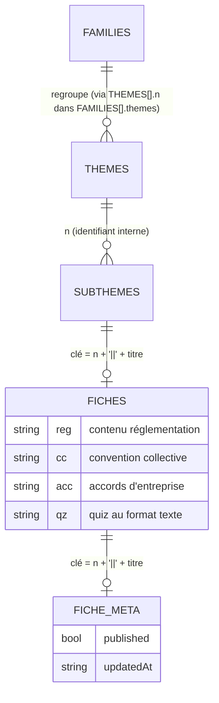
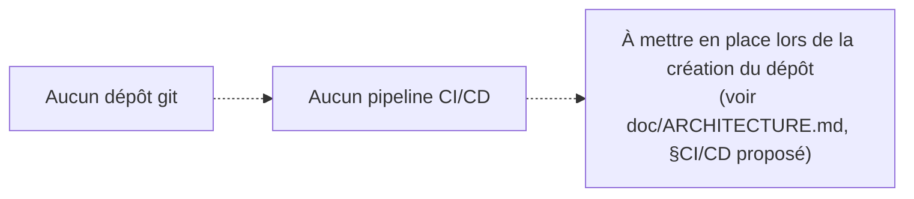

# SPEC-FRONT-0001 — Documentation technique Frontend

> Documente le **frontend prototype** du Livre Blanc de la Paie tel qu'il
> existe aujourd'hui : `LBP_V2-20.html`, un fichier HTML/CSS/JavaScript
> autonome, sans dépôt git et sans back-office. Ce document décrit l'existant
> extrait directement du code — il ne décrit **pas** l'architecture cible de
> reconstruction (Next.js + Supabase + Vercel), qui fait l'objet d'un
> document séparé : `doc/ARCHITECTURE.md`. Le cahier de gouvernance
> `doc/G2S-LBP-01.md` (norme G2S-STD-DOC-01) synthétise ce document sous
> l'angle risques/RGPD/roadmap et y renvoie plutôt que de le dupliquer.
>
> Toute nouvelle intégration sur ce domaine (nouvelle brique, nouveau
> composant, évolution du prototype) doit **ajouter une section à ce
> document** plutôt que d'en créer un nouveau — cf. `doc/DOC_TRACKING.md` (à
> créer lors de la prochaine intégration).

## 1. Contexte & objectif

Ce document couvre le frontend du Livre Blanc de la Paie (LBP) : une
plateforme destinée à devenir _« la Bible des RH et de la Paie »_ pour les
professionnels paie/RH accompagnés par G2S, en remplacement de l'usage actuel
de Notion [Note de cadrage, p.3-4]. Le seul artefact frontend existant à ce
jour est un **prototype interactif** démontrant l'ensemble des écrans et
interactions cibles, mais sans backend ni persistance.

**Périmètre de cette intégration** :

- Architecture générale du prototype (fichier unique, routage applicatif, absence de framework).
- Design system (palette, typographie, composants récurrents), aligné sur le site vitrine G2S.
- Composants transverses organisés par domaine fonctionnel (aucune bibliothèque de composants générique n'existe : chaque écran est une fonction de rendu autonome).
- Modèle de permissions et de paliers commerciaux tel qu'implémenté côté client.
- Points d'attention identifiés directement dans le code (bugs, dette, dépendances fragiles).

**Hors périmètre (intégrations futures)** :

- Pipeline CI/CD GitHub Actions — **inexistant à ce jour** (le projet n'est pas versionné dans un dépôt git ; constat direct de l'environnement de travail). Section 8 renseignée en conséquence.
- Architecture cible de reconstruction (Next.js/Supabase/Vercel) — voir `doc/ARCHITECTURE.md`.
- Backend, base de données, authentification réelle — inexistants dans le prototype (voir §7).

## 2. Vue d'ensemble de la stack / Stack technique

| Composant               | Choix                                                   | Détail                                                                    |
| ----------------------- | ------------------------------------------------------- | ------------------------------------------------------------------------- |
| Structure               | HTML5, un seul fichier                                  | `LBP_V2-20.html` (~3 400 lignes)                                          |
| Style                   | CSS natif, variables `:root`                            | Pas de préprocesseur, pas de framework CSS                                |
| Logique                 | JavaScript ES5/ES6 vanille                              | Pas de framework (React/Vue/etc.), pas de bundler, pas de `package.json`  |
| Typographie             | Google Fonts (CDN)                                      | `Plus Jakarta Sans` (500-800), `Inter` (400-700) — `fonts.googleapis.com` |
| Import de fichiers Word | mammoth.js 1.6.0 (CDN cdnjs)                            | `LBP_V2-20.html`, ligne 3223 ; utilisé lignes 2796, 2987                  |
| Icônes                  | SVG inline (jeu Lucide) + emojis                        | Pas de dépendance à une bibliothèque d'icônes chargée en JS               |
| Réseau                  | 2 endpoints `fetch POST /` (convention _Netlify Forms_) | `LBP_V2-20.html`, lignes 2700-2747 — voir §7                              |
| Gestion de version      | Aucune                                                  | Le dossier de travail n'est pas un dépôt git                              |
| Build / bundler         | Aucun                                                   | Le fichier s'ouvre directement dans un navigateur                         |

### Arborescence du projet

Le frontend n'a pas d'arborescence de projet : c'est un fichier unique, sans
dossier `src/`, sans étape de build. La structure interne du fichier
lui-même tient lieu de plan :

```
LBP_V2-20.html
├── <head>                              lignes 1-961
│   └── <style> (design system CSS)     lignes 10-960
├── <body>
│   ├── <header class="top">            lignes 962-997   (marque, mode, cloche, compte, burger, nav)
│   ├── <div class="filters">           lignes 999-1030  (barre de filtres — bibliothèque uniquement)
│   ├── <main> — 13 <div class="view">  lignes 1031-1233 (un conteneur par écran)
│   └── modales (20 x <div class="modal-bg">)             (disséminées dans le corps)
└── <script> (~2 200 lignes de logique) lignes 1234-3222
    ├── Navigation & modes              1234-1321
    ├── Calendrier RH                   1322-1855
    ├── Actu · Décrypt                  1856-1972
    ├── Veille réglementaire            1973-2065
    ├── Accueil / rappels / chiffres    2065-2240
    ├── Mon équipe / organigramme       2240-2364
    ├── Bibliothèque / fiches           2364-2849
    ├── Quizz                           2849-2913
    └── Notifications, offres, chat     2484-2913 (entrelacé — pas de séparation stricte)
```

Répertoire de travail (`projet-lbp/`) : plusieurs versions antérieures ou
parallèles du prototype coexistent (`copie_LBP.html`, `lbp-v2.html`,
`moscow-lbp.html`, `V7 SITE_INTERNET_V2_accueil-18.html`,
`Constats_de_terrain_LBP.html`). **`LBP_V2-20.html` est la version de
référence** documentée ici : c'est la seule ayant fait l'objet de
corrections d'accessibilité tracées (`MODIFICATIONS_LBP_V2-20.md`) et la
plus récente (dernière modification le 2026-09-15, contre le 2026-09-08 pour
`copie_LBP.html` et `lbp-v2.html`).

## 3. Architecture applicative / Design system

### 3.1 Design system — palette et typographie

Variables CSS définies en `:root` [`LBP_V2-20.html`, lignes 11-34], avec
commentaire explicite dans le code : _« Palette strictement identique à
lbp-vitrine.html — aucune couleur ajoutée »_ (ligne 12) :

| Variable                                   | Valeur                                        | Rôle                                                                                 |
| ------------------------------------------ | --------------------------------------------- | ------------------------------------------------------------------------------------ |
| `--sage`                                   | `#B8C4AC`                                     | Accents doux, niveau Quizz                                                           |
| `--sage-deep`                              | `#6F8657`                                     | Titres secondaires, liens, hover boutons                                             |
| `--sage-darker`                            | `#4F6139`                                     | Hover boutons foncé                                                                  |
| `--ink`                                    | `#181818`                                     | Texte principal, couleur dominante                                                   |
| `--ink-soft`                               | `#595750`                                     | Texte secondaire — **corrigé** depuis `#78766E` pour la conformité WCAG AA (voir §7) |
| `--bg` / `--panel` / `--card` / `--border` | `#F5F3EE` / `#E7E4DC` / `#FFFFFF` / `#E7E3D9` | Fond, panneaux, cartes, filets                                                       |
| `--red` / `--coral`                        | `#C24A3A`                                     | Accent principal, alertes                                                            |
| `--pastel-blue` / `--pastel-blue-deep`     | `#CBD9E3` / `#9FB6C7`                         | Illustrations, icônes                                                                |

Typographie : `Plus Jakarta Sans` (titres, `.disp`/`.eyebrow`/`.section-title`
etc., poids 500-800) et `Inter` (corps de texte, poids 400-700), chargées
depuis Google Fonts.

### 3.2 Layout — composition de l'en-tête

`<header class="top">` [lignes 962-997] : marque cliquable (`.brand`,
retour accueil), sélecteur de mode client/G2S (`#modeSwitch`), cloche de
notifications (`#bellWrap`), bouton compte (`#clientBtn`), bouton burger de
navigation mobile (`#navBurger`, ajouté lors d'une intégration précédente —
voir §7 Historique des interventions), et la barre de navigation principale
(`<nav id="topNav">`, 9 onglets + recherche globale).

### 3.3 Routage applicatif

Pas de bibliothèque de routage. Chaque écran est un bloc
`<div class="view" id="v-{nom}">` ; la fonction `goView(nom)`
[ligne 1271] :

1. masque tous les écrans (`classList.remove('active')`),
2. affiche l'écran demandé,
3. met à jour l'état actif de la barre de navigation,
4. empile l'écran quitté dans `viewHistory` (pile de retour, `goBack()` ligne 1293),
5. déclenche la fonction de rendu de l'écran cible si elle existe (`renderBiblio()`, `renderChiffres()`, etc.).

**13 écrans** recensés : `overview`, `documents`, `docdetail`, `biblio`,
`fiche`, `decrypt`, `chiffres`, `quiz`, `offres`, `offre-detail`, `veille`,
`help`, `account`, `search` (14 identifiants au total, `search` et
`offre-detail` inclus).

### 3.4 Modèle de permissions

Variable globale `appMode` (`'client'` | `'g2s'`, ligne 1237). Le passage en
mode G2S est gardé par une seule condition **côté client** :
`PROFILES[profile].dir === true` (`setMode()`, lignes 1238-1239) — seul le
profil `drh` a `dir:true` [ligne 1186]. `applyModeUI()` [ligne 1249]
affiche/masque les éléments de classe `.g2s-only` et rend inaccessible
l'onglet Veille réglementaire en mode client.

### 3.5 Modèle de paliers commerciaux

Variable globale `tier` (1 à 4, ligne 1231). Le tableau `LEVELS`
[lignes 2478-2483] associe à chaque niveau de lecture d'une fiche un champ
`req` (palier minimum requis), comparé à `tier` pour verrouiller
visuellement le contenu (`const locked = tier < l.req`, ligne 2523). Seul le
niveau « Dans le détail » a `req:2` ; les 4 autres niveaux restent à
`req:1` — voir §7 (point d'attention hérité, non résolu).

## 4. Schéma de données / Composants transverses

Aucune bibliothèque de composants générique n'existe : chaque écran est une
fonction de rendu autonome générant une chaîne HTML injectée via
`innerHTML`. Les « composants transverses » sont ici organisés **par domaine
fonctionnel**, chacun regroupant ses données globales, ses fonctions de
rendu et ses fonctions d'édition (mode G2S) :

| Domaine              | Données globales                                          | Fonctions de rendu                                                                  | Fonctions d'édition (mode G2S)                                |
| -------------------- | --------------------------------------------------------- | ----------------------------------------------------------------------------------- | ------------------------------------------------------------- |
| Accueil              | `HOME`, `HISTO`                                           | `renderOverview()` (2191), `renderReminders()` (2046)                               | `openHomeEditor()` (2090), `saveHome()` (2096)                |
| Calendrier RH        | `RH_CAL`, `CAL_BASE`, `CAL_EVENTS`, `THEMES_CAL`, `EVCOL` | `renderCalendar()` (1767, widget compact), `renderCalFull()` (1721, onglet complet) | `openCalManager()`/`saveCalEvent()` (1654-1712)               |
| Mon équipe           | `TEAM`, `IDENT`, `PAIE`, `OUTILS`, `AVATARS`              | `renderEquipe()` (2259), `renderDocs()` (2302)                                      | `openPersonEditor()` (2272), `openIdentEditor()` (2336), etc. |
| Bibliothèque         | `FAMILIES`, `THEMES`, `SUBTHEMES`, `FICHES`, `FICHE_META` | `renderBiblio()` (2391), `themeBodyHTML()` (2417)                                   | `openFicheEditor()` (2801), `saveFiche()` (2822)              |
| Fiche                | `LEVELS`, `COMPRENDRE_SECTIONS`, `DETAIL_SECTIONS`        | `openFiche()` (2516), `selLevel()` (2531)                                           | `validateFicheUpdate()` (2504)                                |
| Actu · Décrypt       | `actuArticles`, `ACTU_TAXONOMY`                           | `renderDecrypt()` (1949), `renderActuGrid()` (1950)                                 | `saveActuItem()` (1910), `publishActu()` (1924)               |
| Chiffres Paie        | `CHIFFRES`                                                | `renderChiffres()` (2129)                                                           | `openChiffresEditor()` (2173), `saveChiffres()` (2181)        |
| Quizz                | `QUIZZES`, `QZSCORES`                                     | `renderQuizModule()`, `quizPlayerHTML()` (2870)                                     | `openQuizEditor()`, `parseQuiz()` (2852)                      |
| Offres               | `OFFERS`, `TIER_NAME`, `LVLABEL`                          | `renderOffres()` (2658), `openOfferPage()` (2675)                                   | `openOfferEditor()` (2590), `saveOffer()` (2607)              |
| Veille réglementaire | `VEILLE`, `VEILLE_SOURCES`                                | `renderVeille()` (2009), `veilleCardHTML()` (1995)                                  | `openVeilleEditor()` (2031), `saveVeille()` (2035)            |
| Notifications        | `NOTIFS`, `FICHE_UPDATES`                                 | `renderNotifPanel()` (2489)                                                         | `addNotif()` (2486), `markAllRead()` (2499)                   |
| Compte / Mon compte  | `PROFILES`, `COMPANY`                                     | `renderAccount()`                                                                   | —                                                             |
| Recherche globale    | (interroge `THEMES`/`SUBTHEMES`/`FICHES`)                 | `renderSearch()` (3048)                                                             | —                                                             |
| Assistance (chat)    | —                                                         | `toggleChat()` (2717)                                                               | `sendChat()` (2737)                                           |

Diagramme des relations entre les référentiels de la Bibliothèque (le
domaine le plus riche du prototype) :



## 5. Référentiels applicatifs / Icônes & conventions

| Référentiel                         | Contenu                                                            | Ligne   |
| ----------------------------------- | ------------------------------------------------------------------ | ------- |
| `TIER_NAME`                         | Libellés des 4 offres commerciales                                 | 1232    |
| `LEVELS`                            | 5 niveaux de lecture d'une fiche + palier requis                   | 2478    |
| `THEMES` / `SUBTHEMES` / `FAMILIES` | Arborescence bibliothèque (18 thèmes, 139 sous-fiches, 3 familles) | 1189 s. |
| `CAL_TAX`                           | Taxonomie du calendrier (thèmes, types d'événement, formats)       | 1397    |
| `ACTU_TAXONOMY`                     | Thèmes/sous-thèmes des actualités                                  | 1856    |
| `VEILLE_SOURCES`                    | 7 sources officielles de veille réglementaire                      | 1973    |

**Conventions observées dans le code** (extraites, pas inventées) :

- Fonctions JavaScript en camelCase, préfixées par leur action : `render*`
  (affichage), `open*` (ouverture d'un éditeur/modale), `save*` (validation
  d'une saisie), `del*` (suppression).
- Échappement systématique du texte utilisateur avant insertion dans le DOM
  via `escHtml()`/`escAttr()` [lignes 2756, 2851] — présenté dans le cahier
  des charges comme _« à conserver impérativement en cible »_ [§4.6, p.21].
- Normalisation de recherche (minuscules + suppression des diacritiques) via
  `normText()` [ligne 2757], appliquée de façon cohérente à la recherche
  bibliothèque, la recherche globale et le filtre d'actualités.
- Clé composite `"{n° de thème}||{titre de la fiche}"` pour identifier une
  fiche de façon unique (`ficheKey()`, ligne 2755) — reprise du format
  documenté au cahier des charges [§3.13.3, p.39].
- Icônes : SVG inline au format Lucide (`class="lucide lucide-{nom}"`) pour
  les icônes fonctionnelles de la navigation, emojis Unicode pour les
  pictogrammes de contenu (fiches, cartes, badges).
- Avatars : générés proceduralement par la fonction `avatar()` [ligne 2240]
  à partir de paramètres (teint, coiffure, barbe, fond), pas d'images
  statiques téléversées — bibliothèque de 124 combinaisons [Cahier des
  charges §1.3.2, p.9].

## 6. Commandes de gestion / Composition des layouts

Le prototype n'a pas de commandes CLI (pas de build, pas de serveur). La
« composition des layouts » se limite à l'assemblage du document HTML :

```
<body>
  <header class="top">        ← marque + mode + cloche + compte + burger + nav
  <div class="filters">        ← visible uniquement sur l'écran Bibliothèque
  <main>
    <div class="view active" id="v-overview">   ← écran affiché au chargement
    ... (12 autres <div class="view">, masqués par défaut)
  </main>
  <footer>                     ← mentions légales / palette
  (20 modales <div class="modal-bg">, masquées par défaut, activées par classList.add('show'))
  <div id="chatFab">            ← bulle d'assistance flottante
</body>
```

Au chargement (fin du `<script>`), le prototype : applique le mode courant
(`applyModeUI()`), affiche le profil connecté (`updateClientBtn()`), effectue
le premier rendu de l'écran Accueil, initialise les notifications de
démonstration (`seedNotifs()`) et met à jour le compteur de la cloche
(`updateBell()`).

## 7. Points d'attention identifiés dans le code

Points extraits directement du code ou de documents de vérification
existants — pas de supposition de notre part.

| Point                                                                                                                                                | Nature                                                                                 | État vérifié dans `LBP_V2-20.html`                                                                                        | Référence                                                                 |
| ---------------------------------------------------------------------------------------------------------------------------------------------------- | -------------------------------------------------------------------------------------- | ------------------------------------------------------------------------------------------------------------------------- | ------------------------------------------------------------------------- |
| Verrouillage de contenu par palier limité à 1 niveau sur 5                                                                                           | Écart au modèle commercial                                                             | **Toujours présent**                                                                                                      | lignes 2478-2483 ; `RAPPORT_VERIFICATION_CONSTATS_TERRAIN.md`, constat 02 |
| Fiche créée depuis la veille visible client avant validation                                                                                         | Bug de sécurité de publication                                                         | **Corrigé** — `fichePublished()` retourne `false` par défaut                                                              | ligne 2754                                                                |
| Changement de palier sans récapitulatif ni CGV                                                                                                       | Oubli de validation                                                                    | **Partiellement corrigé** — confirmation ajoutée, mais le texte du dialogue reconnaît lui-même l'absence de récapitulatif | lignes 1309-1312                                                          |
| Recherche insensible aux accents/casse                                                                                                               | Ancien bug (« conges » ne trouvait pas « congés »)                                     | **Corrigé** — `normText()` appliqué des deux côtés de la comparaison                                                      | lignes 1953-3052                                                          |
| Import Word dépendant d'une connexion Internet                                                                                                       | Fragilité documentée                                                                   | **Confirmé** — le code vérifie lui-même `typeof mammoth==='undefined'` et alerte l'utilisateur                            | lignes 2796, 2987                                                         |
| Numérotation des thèmes à double identifiant                                                                                                         | Dette de modélisation                                                                  | **Confirmé** — `THEMES[].n` (identifiant interne, ex. « 20 ») distinct du rang d'affichage recalculé par `themeDispNum()` | ligne 2357                                                                |
| Deux jeux de données calendrier parallèles (`RH_CAL` et `CAL_BASE`) avec deux pipelines de rendu distincts (`renderCalendar()` vs `renderCalFull()`) | Duplication potentielle (à investiguer en reconstruction — voir `doc/ARCHITECTURE.md`) | Confirmé structurellement ; le degré de redondance fonctionnelle réelle n'a pas été mesuré exhaustivement                 | lignes 1345, 1421, 1767, 1721                                             |
| Corrections d'accessibilité WCAG 2.1 AA appliquées (`--ink-soft`, badge `.col.reg h5`)                                                               | Amélioration tracée                                                                    | Confirmé présent                                                                                                          | lignes 14, 172 ; `MODIFICATIONS_LBP_V2-20.md`                             |
| Deux flux réseau réels vers Netlify Forms (`offre-lbp`, `contact-lbp`)                                                                               | Collecte de données si déployé publiquement                                            | Confirmé                                                                                                                  | lignes 2700-2747                                                          |
| Aucune persistance (`localStorage`/`fetch` de données absents)                                                                                       | Limite structurelle du prototype                                                       | Confirmé par recherche exhaustive                                                                                         | Cahier des charges §3.1/§6.2                                              |
| Aucun test automatisé, aucune journalisation                                                                                                         | Dette qualité                                                                          | Confirmé — aucun fichier de test dans le dossier                                                                          | Cahier des charges §6.13                                                  |
| Bouton burger de navigation mobile                                                                                                                   | Intégration antérieure à cette SPEC (session précédente)                               | Ajouté au header, positionné à droite via `margin-left:auto`                                                              | lignes 962-997 (voir historique des versions)                             |

**Historique des interventions déjà tracées avant cette SPEC** (contexte,
non ré-audité en détail ici) : ajout d'un menu burger de navigation mobile
(`#navBurger`, toggle de `#topNav` sous 900px) et son repositionnement à
l'extrémité droite de l'en-tête ; corrections de contraste WCAG 2.1 AA
listées dans `MODIFICATIONS_LBP_V2-20.md`.

## 8. Pipeline CI/CD GitHub Actions

**Hors périmètre — inexistant.** Le dossier de travail n'est pas un dépôt
git (constat direct de l'environnement de travail à la date de cette SPEC :
_« Is a git repository: false »_). Aucun fichier `.github/workflows/`
n'existe. Cette section est renseignée explicitement en `N/A` plutôt
qu'omise, conformément au principe de transparence du standard G2S.

### 8.1 Déclenchement

N/A — aucun dépôt git, aucun déclencheur possible à ce stade.

### 8.2 Jobs

N/A.

### 8.3 Fichiers de configuration associés

N/A.

### 8.4 Schéma du pipeline



## 9. Historique des versions

| Version | Date       | Auteur         | Contenu                                                                                                                                                                                                                           |
| ------- | ---------- | -------------- | --------------------------------------------------------------------------------------------------------------------------------------------------------------------------------------------------------------------------------- |
| 1.0.0   | 2026-09-16 | James Ahmedaly | Première intégration : documentation exhaustive du frontend prototype `LBP_V2-20.html` (architecture, design system, composants par domaine, référentiels, points d'attention). Pipeline CI/CD marqué N/A (absence de dépôt git). |
